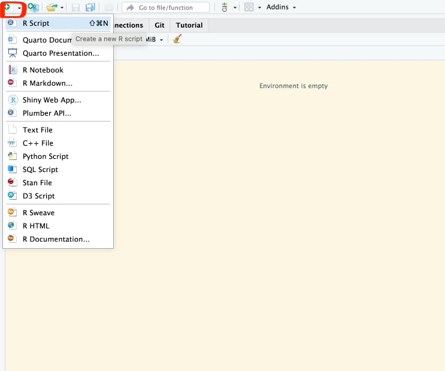
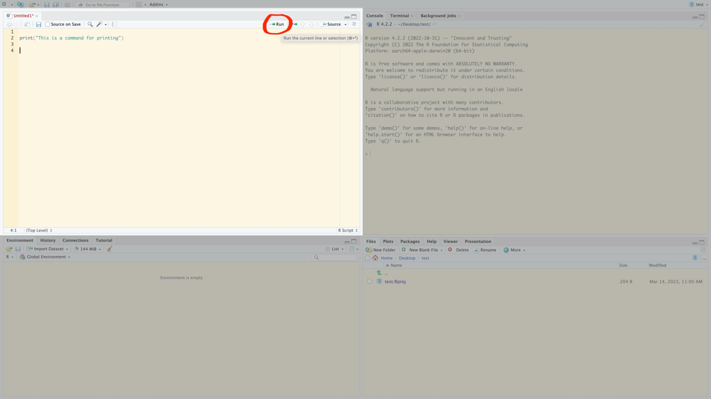
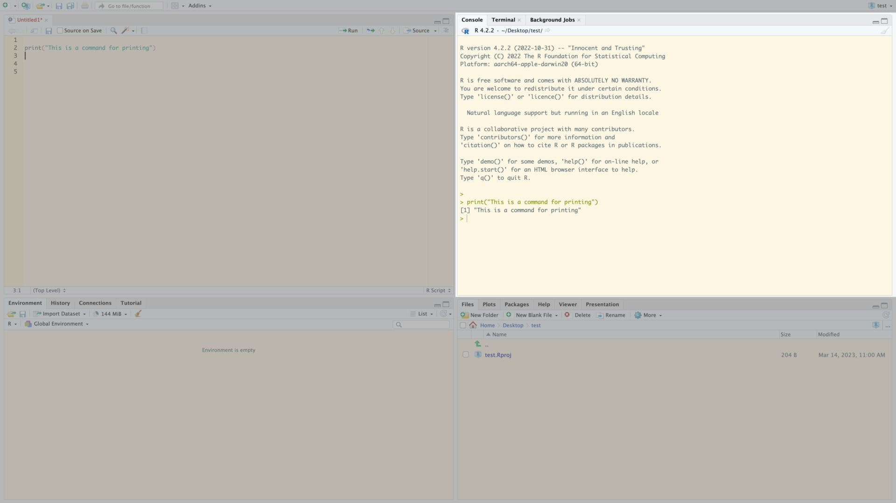

```{r setup, include=FALSE}
knitr::opts_chunk$set(collapse = TRUE, comment = "##", dev="png")
library(knitr)
library(kableExtra)
```


## Introduction to R

* `R` is two things:
   1. A statistical programming language
   2. A software package implementing the R language (available at [https://cran.r-project.org/](https://cran.r-project.org/))
* `RStudio` is a comprehensive working environment for R ([https://rstudio.com/products/rstudio/](https://rstudio.com/products/rstudio/))
   - An editor, for writing R programs
   - Tools to help you write and analyse code
   - An R console and interpreter


## Setting up your workspace

### Step 1

[Download and install R](https://cran.r-project.org)

### Step 2

[Download and Install Rstudio](https://posit.co/download/rstudio-desktop/)


## Parts of Rstudio

After launching Rstudio, create a new R **script** using the button in the upper left

{width=35%}

**Script**: a text file where you will write an R-program. Commands in a script will be run in order, from the top to the bottom.

## Parts of Rstudio

* The **editor** pane is where you will write your scripts. 
* Commands here are not run automatically!
	- Run them by using the *run* command (control-return$^1$)

{width=55%}

$^1$Mac users: usually you can substitute the command (&#8984;) key for control, and option for alt

## Parts of Rstudio

* The **console** pane is where commands are executed. 
* Commands here can be sent from a script
* Or you can enter them directly
	- Commands entered directly in the console are run as soon as you press return!
* Note that your panes may be in a slightly different arrangement!

{width=55%}


## Helpful vocabulary

* **console**: A window where you can type commands and view (text) results and output
* **interpreter**: Software that translates R commands into instructions for your computer in real time
* **script**: a text file containing a program, or series of commands
   - can be run **interactively** (sending commands one at a time to the console)
   - or in **batch mode** (all commands run, one after the other)
* **working directory**: location on your computer where R will search for files, data, etc.


## Recommendations
* Create an RStudio project to organize your work (File => New Project).
	- Everyone do this now for this course!
* Store all files in the project folder (your project will be **self-contained**).
* Save related commands together in a script.
* Annotate your code with comments. Write more comments than you need.
   - In R, anything after the `#` character is a comment and will be ignored by the interpreter.


## Variables

<div class="left lt">
* A **variable** is a name that points to some data. 
  - Variable names can contain lower- or upper-case letters, numbers, and the `_` symbol.
  - Names must start with letters and (when possible) should be descriptive
* Variables are given values by **assignment** using either the `=` or `<-` symbol

### Recommendations
* Use descriptive variable names instead of comments.
* Avoid 1- and 2- letter names.
* Separate words with underscores.
* Use a consistent assignment operator (`=` or `<-`, not both)
</div>

<div class="right rt">

```{r error=TRUE}
# Comments in R start with the # symbol
# anything after # will not be executed
# Comments are a useful way to annotate your code so you know what is 
# happening

# Legal variable names
x = 1
y0 = 5
time_of_day = "20:15"
dayOfWeek <- "Monday"

# bad!
# d is the diversity in our site, in species
d = 8

# better!
site_diversity = 8


# error
0y = 5
my name = "Matt"
```

</div>


## Numeric operators

<div class="left lt">

* We use **operators** to perform computations on variables and constants
* The **numeric** data type is for numbers; we can perform basic math on them with mathematical operators
* The **assignment operators** give a value to a variable


* Assignment: `=`, `<-`
	- Both work mostly the same, use alt dash (-) for `<-`
* Math: `+`, `-`, `*`, `/`, `^`
</div>

<div class="right rt">

```{r}
# assignment
x = 5
# equivalent
x <- 5

# class tells you the data type of a variable
class(x)

# math
x + 2
(3 + x) * 2
3^2

```

</div>


## Functions

<div class="left lt">
* **Functions** take **arguments** (which can be variables or constants).
* The function performs computations on the arguments.
* Functions can **return** a result, have **side-effects**, or both.

**Mathematical & functions**

* `sin()`, `cos()`
* `log()`, `exp()`, `sqrt()`

Get help on a function with `?` or `help()`, for example: `?log` or `help(log)`.
If you don´t know a function's name, you can search for a (likely/suspected) string in its name with `??`.


</div>

<div class="right rt">

```{r}
x = 5

# The print() function takes one or more arguments
#      in this case the variable x
# It returns no value, but has the side effect of printing the 
# value of x to the screen
print(x)

# compute the natural logarithm of x
# then store it in y, then print the result
y = log(x)
print(y)

# functions can take multiple arguments, and arguments can be named
# here we change the base of the logarithm
log(x, base = 10)
# equivalents, found in the help file with ?log
#     log(x, 10)
#     log10(x)
```

</div>


## Data structures: vectors

<div class="left lt">
* A **data structure** is a way of organizing multiple pieces of data into a single variable
* A `vector` holds one or more values of a single data type

</div>

<div class="right rt">

```{r}
# The c() function stands for concatenate
# it groups items together into a vector
(five_numbers = c(3, 2, 8.6, 4, 9.75))

# math on vectors is performed on each element
five_numbers + 1

# vectors of other data types
class(five_numbers)
(five_letters = c("c", "b", "z", "q", "w"))
class(five_letters)
sort(five_letters)

as(five_numbers, "integer")

```

</div>


## Vectors: creation

<div class="left lt">
* The `:` operator creates a sequence of integers, counting by ones
* More general sequences use the `seq` function
	- Third argument tells you what to count by
* Repeat values with `rep`

</div>

<div class="right rt">

```{r}
# The c() function stands for concatenate
# it groups items together into a vector
(five_numbers = c(3, 2, 8.6, 4, 9.75))

# Creating vectors
(one_to_ten = 1:10)
class(one_to_ten)
# integers are *also* numeric
is(one_to_ten, "numeric")

## sequences and repeats
seq(1, 5, 0.4)
rep(0, 3)


```

</div>


## Vectors: indexing

<div class="left lt">
* We can use **indexing** to get a part of a vector by its position
	- use the `[]` operator
	- an index can be multiple values!
* In R, the first index is always 1
* Asking for an index outside the allowable range is an error

</div>

<div class="right rt">

```{r error = FALSE}
five_numbers
five_numbers[1]
five_numbers[3:5]
five_numbers[c(1,4)]

# get vector length
length(five_numbers)
five_numbers[10]

# can index with another variable
(i = length(five_numbers))
five_numbers[i]

# also an expression
five_numbers[i - 1]

```

</div>

## More basic functions

<div class="left lt">
* Basic statistical functions have mostly obvious names
* Mathematical functions will operate separately on each vector element
</div>

<div class="right rt">

```{r error = FALSE}
mean(five_numbers)
median(five_numbers)
sd(five_numbers)
var(five_numbers)
sum(five_numbers)

# mathematical functions
exp(five_numbers)
log(five_numbers)
```

</div>


## Reading in real data

Download the [Palmer penguins dataset](https://raw.githubusercontent.com/allisonhorst/palmerpenguins/main/inst/extdata/penguins.csv)

Save this in your project folder, inside another folder named `data`


```{r penguins, echo=FALSE, fig.align = "left", out.width="35%"}
knitr::include_graphics("img/lter_penguins.png")
```

<font size=4>Artwork by @allison_horst</font>

## Reading in real data

<div class="left lt">
* The `read.csv` function takes a file path or URL as the argument
* Returns a tabular data structure called a `data.frame`
* `"data/penguins.csv"` is a **relative path**. 
	- R will search inside the working directory for a folder named `"data"`.
* An **absolute path** gives the location on your computer, starting from the very top. Example:

`"/Users/mtalluto/Desktop/intro_r/data/penguins.csv"`

**Recommendation**: use relative paths!

*Hint: use `..` to refer to one directory above the current (working) directory*

</div>


<div class="right rt">

```{r}
penguins = read.csv("data/penguins.csv")
# read.csv also takes URLs!
# penguins = read.csv("https://raw.githubusercontent.com/allisonhorst/palmerpenguins/main/inst/extdata/penguins.csv")
class(penguins)
```


</div>


## Data prep recommendations
<div class="left lt">

* Prepare data in excel
* The first row is a header with column names
* Choose good column names (no spaces or special characters, include units)
* In a separate file, describe the dataset, how it was collected, and the meaning of each column
* Arrange your data so that each row is a single observation, each column is a variable ("tidy" data)

</div>

<div class="right rt">
```{r echo = FALSE, results = 'asis'}
kable_styling(kable(head(penguins)), font_size = 12)
```
</div>

## Data Frames

<div class="left lt">
* A dataframe is a special kind of 2-dimensional data structure
	* Rows represent **cases**
	* Columns are **variables**
* Each column is a vector and must follow vector rules
	* each item must have the same data type
* You can use `str` to see the structure of a dataframe, and `View` to open an interactive window
* `head` will give you the first few rows
</div>

<div class="right rt">
```{r}
str(penguins)
head(penguins)
```


</div>


## Accessing parts of data frames

<div class="left lt">
* Extract a single column as a vector using the `$` operator
	* Each column name is a variable that is visible only inside the `data.frame`!
	* `$` lets you 'peek' inside

</div>

<div class="right rt">
```{r eval = TRUE, error = TRUE}
# I want the variable bill_length_mm
# It is not visible by name
bill_length_mm

# get the variable from inside penguins
penguins$bill_length_mm
```
</div>

## Accessing parts of data frames

<div class="left lt">
* Extract a single column as a vector using the `$` operator
	* Each column name is a variable that is visible only inside the `data.frame`!
	* `$` lets you 'peek' inside
* More complex indexing is available with `[]`
</div>

<div class="right rt">
```{r}
# Get the first value in the third column
penguins[1,3]

# Get the whole third column, then use head to print the first six values
head(penguins[,3])

# First five values of columns 3 and 4
penguins[1:5, c(3,4)]

# Can also index by name
penguins[1:5, c("bill_length_mm", "bill_depth_mm")]

# Remove the first 300 rows
penguins[-(1:300),]
```
</div>


## Practise with data frames

Read in the penguin data using `read.csv`. Store it in a variable named `penguins`. Then try to do the following.

1. How many rows and columns are in the dataset? Use `dim`, `nrow`, and `ncol`.
2. What is the output of `mean(penguins$bill_depth_mm)`? Why? What if you try `mean(penguins$bill_depth_mm, na.rm = TRUE)`? Check the help file by typing `?mean`. Does the same logic work for `sd`?
3. How many penguins were captured in each year? Try the `table` function.
4. You can use table with multiple columns of data. Try to find out how many of each species were captured in each year.
	 - Hint: use `c()` inside `[]` to get multiple columns. See the previous slide.
5. Add a new column called `body_mass_kg`, and compute the body mass, in kg instead of g.
	- Hint: you can use `$` to create a new column by name

## Practise with data frames

```{r}
## 1.
# dim gives rows and columns, in that order
nrow(penguins)
ncol(penguins)
dim(penguins)

## 2.
# there are missing values, so this doesn't work
mean(penguins$bill_depth_mm)
# adding na.rm = TRUE gives us what we expect
mean(penguins$bill_depth_mm, na.rm = TRUE)
sd(penguins$bill_depth_mm, na.rm = TRUE)

## 3.
table(penguins$year)

## 4. 
table(penguins[, c('species', 'year')])

## 5.
# nothing is printed! but the new column is created with the data already stored
# can confirm by looking at the data frame with head
penguins$body_mass_kg = penguins$body_mass_g / 1000
head(penguins)
```


## More programming: logic and comparison

<div class="left lt">
* The **logical** data type indicates yes/no, true/false data
* Represented by the special values `TRUE` and `FALSE` (no quotes)
* We can use **comparison operators** to compare values and produce **logical** results
	* `==`, `!=`, `<`, `>`, `<=`, `>=`
</div>

<div class="right rt">

```{r}
# less than, greater than, less/greater or equals
1 < 2
class(1 < 2)

2 <= 2
2 > 4
'q' >= 'm'

# equality testing
2 == 1 + 1
2 != 'q'

# be careful with decimals!
0.2 + 0.1 == 0.3
# preferred:
all.equal(0.1 + 0.2, 0.3)

```

</div>

## Logical operators

<div class="left lt">
* We can combine logical expressions with the **logical operators**
	* `&` (and), `|` (or; the vertical bar), `!` (not).

</div>

<div class="right rt">

```{r}
# and: both must be true
TRUE & TRUE
TRUE & FALSE
FALSE & FALSE

# or: only one needs to be true
TRUE | FALSE
FALSE | FALSE

# not: returns the opposite
!FALSE

# both statements are TRUE, so this is TRUE
1 + 1 == 2 & 2 < 4
```

</div>


## Logical subsets

<div class="left lt">
* You can use a logical statement as an indexing variable!
</div>

<div class="right rt">

```{r}
five_numbers

# show me which entries are greater than 3
five_numbers > 3

# give me the values of five_numbers which are greater than three
five_numbers[five_numbers > 3]

```

</div>

## Logical subsets of data frames

<div class="left lt">
* The `subset` function lets you easily take pieces of a data frame
* The `%in%` operator lets you match multiple categories

* **Exercise**: use `subset` to compute the mean bill length and bill depth for Gentoo penguins
</div>

<div class="right rt">

```{r eval = FALSE}
# Try these, what do they do?
subset(penguins, species == "Adelie" & sex == "Male" & year != 2007)

subset(penguins, species %in% c("Chinstrap", "Gentoo"))

```

</div>

## Logical subsets of data frames

<div class="left lt">
* The `subset` function lets you easily take pieces of a data frame
* The `%in%` operator lets you match multiple categories

* **Exercise**: use `subset` to compute the mean bill length and bill depth for Gentoo penguins
</div>

<div class="right rt">

```{r}
penguins_gentoo = subset(penguins, species == "Gentoo")
mean(penguins_gentoo$bill_length_mm, na.rm = TRUE)
mean(penguins_gentoo$bill_depth_mm, na.rm = TRUE)

```

</div>


## Cleaning up the penguin data

<div class="left lt">
Our data frame has some missing data. Let's remove the incomplete cases using the `complete.cases` function.
</div>

<div class="right rt">

```{r eval = FALSE}
# Try this: what is the output?
complete.cases(penguins)
```

```{r}
# what is this doing? why does this work?
sum(! complete.cases(penguins))
```

```{r}
# Again, break this down one piece at a time
# start inside the brackets and work out
penguins = penguins[complete.cases(penguins), ]
```
</div>


## Getting summary statistics

<div class="left lt">
* We have learned some basic functions for summary statistics
	- `mean`, `sd`, `var`
	- `quantile`, `range`, `sum`
	- `complete.cases`
* But our data has multiple partitions! 
	- `species`, `sex`, `year`, `island`
	- What if we want to summarise across these partitions?

</div>

<div class="right rt">
```{r echo = FALSE}
library(ggplot2)
p2 = reshape2::melt(within(penguins, rm("body_mass_kg")), id.vars = c('species', 'island', 'sex', 'year'))
peng_box = ggplot(p2) + geom_boxplot(aes(x = species, fill = sex, y = value)) + 
	facet_wrap(~variable, scales = "free_y", strip.position = "left",
			   labeller = as_labeller(c(bill_length_mm = "Bill length (mm)", bill_depth_mm = "Bill depth (mm)",
			   						 flipper_length_mm = "Flipper length (mm)", body_mass_g = "Body mass (g)"))) +
	scale_fill_manual(values = c("pink","royalblue")) + theme_minimal() + 
	theme(strip.placement = "outside", axis.title.y=element_blank(), strip.text = element_text(size = 12),
		  axis.text.y = element_text(size = 11), axis.text.x = element_text(size = 11))
peng_box
```
</div>
	

## Getting summary statistics

<div class="left lt">
* `table` allows us to count cases across partitions
* `tapply` (apply a function in a table) is a generalisation of `table`, allows us to compute any statistic across partitions
	- syntax: first the variable, then the partition, then the statistical function, then additional arguments

```{r}
# one variable, one partition
tapply(penguins$bill_length_mm, penguins$species, mean, na.rm = TRUE)

# one variable, two partitions
tapply(penguins$bill_length_mm, penguins[, c('species', 'sex')], 
	   mean, na.rm = TRUE)
```
</div>

<div class="right rt">
```{r echo = FALSE}
peng_box
```
</div>
	

## Getting summary statistics

<div class="left lt">
* `table` allows us to count cases across partitions
* `tapply` (apply a function in a table) is a generalisation of `table`, allows us to compute any statistic across partitions
	- syntax: first the variable, then the partition, then the statistical function, then additional arguments
* `sapply` (simple apply) applies a function to multiple *variables* but with no partitions
	- first the variables, then the function

```{r}
# compute the sd of every variable
pvars = penguins[, c('bill_length_mm', 'bill_depth_mm', 
					 'flipper_length_mm', 'body_mass_g')]
sapply(pvars, sd)
```
</div>

<div class="right rt">
```{r echo = FALSE}
peng_box
```
</div>

## Summary statistics: practise

* Subset the data to look only at Adelie penguins.
* Does the distribution of flipper length of Adelie penguins vary among the different islands? Make sure you account for sex. Check the mean, sd, median, min, and max.
* Try making a box and whisker plot using the `boxplot` function. Try the following syntax: `boxplot(y ~ group1 + group2, data = penguins)`. 
	- For `y`, substitute the name of the variable inside penguins that you want to plot (e.g., `flipper_length_mm`).
	- For `group1` and `group2`, substitite the names of any grouping variables you want to use, like `sex`.
* Customize your plot. Check the help file for boxplot and try changing some of the defaults to improve the appearance of your plot. Some example argu,ments you could change:
	- `xlab` and `ylab`, the axis titles
	- `border`, `col`, the colors of the box borders and the fill color
	- `notch`, `boxwex` (see if you can figure them out from the help file, or by experimenting)


## Summary statistics: practise
<div class="left lt">

```{r}
# Subset the data to look only at Adelie penguins.
penguins_adelie = subset(penguins, species == "Adelie")

# Does the distribution of flipper length of Adelie penguins vary
# among the different islands?
# we can use tapply with the different functions

## mean
tapply(penguins_adelie$flipper_length_mm, 
	   penguins_adelie[, c('island', 'sex')], mean)

## sd
tapply(penguins_adelie$flipper_length_mm, 
	   penguins_adelie[, c('island', 'sex')], sd)

## median
tapply(penguins_adelie$flipper_length_mm, 
	   penguins_adelie[, c('island', 'sex')], median)

## min
tapply(penguins_adelie$flipper_length_mm, 
	   penguins_adelie[, c('island', 'sex')], min)

## max
tapply(penguins_adelie$flipper_length_mm, 
	   penguins_adelie[, c('island', 'sex')], max)

```
</div>

## Summary statistics: practise
<div class="left lt">

```{r}
# Subset the data to look only at Adelie penguins.
penguins_adelie = subset(penguins, species == "Adelie")

# Does the distribution of flipper length of Adelie penguins vary
# among the different islands?
# we can use tapply with the different functions

## mean
tapply(penguins_adelie$flipper_length_mm, 
	   penguins_adelie[, c('island', 'sex')], mean)

## sd
tapply(penguins_adelie$flipper_length_mm, 
	   penguins_adelie[, c('island', 'sex')], sd)

## median
tapply(penguins_adelie$flipper_length_mm, 
	   penguins_adelie[, c('island', 'sex')], median)

## min
tapply(penguins_adelie$flipper_length_mm, 
	   penguins_adelie[, c('island', 'sex')], min)

## max
tapply(penguins_adelie$flipper_length_mm, 
	   penguins_adelie[, c('island', 'sex')], max)

```
</div>

<div class="right rt">
```{r}
# a boxplot is a much nicer way to visualise this
boxplot(flipper_length_mm ~ island+sex, data = penguins_adelie)
```
</div>


## Summary statistics: practise
<div class="left lt">

```{r}
# Subset the data to look only at Adelie penguins.
penguins_adelie = subset(penguins, species == "Adelie")

# Does the distribution of flipper length of Adelie penguins vary
# among the different islands?
# we can use tapply with the different functions

## mean
tapply(penguins_adelie$flipper_length_mm, 
	   penguins_adelie[, c('island', 'sex')], mean)

## sd
tapply(penguins_adelie$flipper_length_mm, 
	   penguins_adelie[, c('island', 'sex')], sd)

## median
tapply(penguins_adelie$flipper_length_mm, 
	   penguins_adelie[, c('island', 'sex')], median)

## min
tapply(penguins_adelie$flipper_length_mm, 
	   penguins_adelie[, c('island', 'sex')], min)

## max
tapply(penguins_adelie$flipper_length_mm, 
	   penguins_adelie[, c('island', 'sex')], max)

```
</div>

<div class="right rt">
```{r}
# a boxplot is a much nicer way to visualise this
# the defaults are quite ugly, let's improve things
# I chose colours using colorbrewer
# https://colorbrewer2.org/#type=qualitative&scheme=Paired&n=7
# 3 colors, one for each island
cols = rep(c("#a6cee3", "#fb9a99", "#fdbf6f"), 2)
boxplot(flipper_length_mm ~ island+sex, data = penguins_adelie, 
		at = c(1.6,2,2.4,    3.6,4,4.4), # at controls x-location, allows grouping by sex
		col = rep(cols, 2), # set the colours, repeated twice (female and male)
		names = c("", "Female", "", "", "Male", ""), # labels under the boxes
		xlab = "", ylab = "Flipper length (mm)", # set axis titles
		bty = 'n', #disable the box around the plot
		notch = TRUE,
		boxwex = 0.3 # thinner boxes
)
# add a legend to the plot
legend("topleft", legend = unique(penguins_adelie$island), 
	   title = "Island", fill = cols, bty = 'n')
```
</div>


## Basic statistical tests

* We saw with the box plot the syntax `y ~ x`
* In R, this is called a **formula**
* Read this as "y is modelled by x"
* We can use this for many plots and basic statistical tests

## Comparing means

<div class="left lt">
* Hypothesis: in Gentoo penguins, males are heavier than females
* Exercise: test this hypothesis with the function `t.test`

</div>

<div class="right rt">
```{r echo = FALSE}
penguins_gentoo = subset(penguins, species == "Gentoo")
pl = ggplot(penguins_gentoo) + geom_boxplot(aes(x = sex, y = body_mass_g, fill = sex)) + theme_minimal() + ggtitle("Gentoo penguins")
pl
```
</div>

## Comparing means

<div class="left lt">
* Hypothesis: in Gentoo penguins, males are heavier than females
* Exercise: test this hypothesis with the function `t.test`
* Add `paired = TRUE` for a paired t-test

```{r}
penguins_gentoo = subset(penguins, species == "Gentoo")
tapply(penguins_gentoo$body_mass_g, penguins_gentoo$sex, mean)
# why less??
t.test(body_mass_g ~ sex, data = penguins_gentoo, alternative = "less")

```
</div>

<div class="right rt">
```{r echo = FALSE}
pl
```
</div>


## Comparing means: more than 2 groups

<div class="left lt">
* We can use the function `aov` to do an analysis of variance when there are more than 2 groups
* Hypothesis: For male Adelie penguins, there are differences in bill length on the different islands
* By itself, the output of `aov` is not helpful. Try using the `summary` function on the output instead.


</div>
<div class="right rt">
```{r echo = FALSE}
penguins_adelie_m = subset(penguins, species == "Adelie" & sex == "male")
pl = ggplot(penguins_adelie_m) + geom_boxplot(aes(x = island, y = bill_length_mm, fill = island)) + 
	theme_minimal() + ggtitle("Male Adelie penguins")

pl
```
</div>

## Comparing means: more than 2 groups

<div class="left lt">
* We can use the function `aov` to do an analysis of variance when there are more than 2 groups
* Hypothesis: For male Adelie penguins, there are differences in bill length on the different islands
* By itself, the output of `aov` is not helpful. Try using the `summary` function on the output instead.

```{r}
penguins_adelie_m = subset(penguins, species == "Adelie" & sex == "male")
tapply(penguins_adelie_m$bill_length_mm, penguins_adelie_m$island, mean)
adelie_m_model = aov(bill_length_mm ~ island, data = penguins_adelie_m)
summary(adelie_m_model)

```

</div>

<div class="right rt">
```{r echo = FALSE}
pl
```
</div>


## Comparing proportions

<div class="left lt">
* Is the sex ratio for Gentoo penguins significantly different from 0.5?
* Use the `table` function to view the counts
* Try `barplot` for visualising
* Use `prop.test` for the significance test

</div>


## Comparing proportions

<div class="left lt">
* Is the sex ratio for Gentoo penguins significantly different from 0.5?
* Use the `table` function to view the counts
* Try `barplot` for visualising
* Use `prop.test` for the significance test

```{r}
# save it in a variable so we can use the counts later
tab = table(penguins_gentoo$sex)
tab
prop.test(tab)
```
</div>

<div class="right rt">
```{r echo = FALSE}
barplot(tab, col = c("pink", "lightblue"))

```

</div>


## Comparing proportions: multiple variables

<div class="left lt">
* Perhaps the sex ratio varies by species
* We can see if the variable `sex` is associated with the variable `species` using a **chi-squared test**.
* Use `table` and `barplot` for exploration.
* Use `chisq.test` for the test

</div>


## Comparing proportions: multiple variables

<div class="left lt">
* We could ask if the proportions of each species vary by year
* We can see if the categorical variables `year` and `species` are associated using a **chi-squared test**.
* Use `table` and `barplot` for exploration.
* Use `chisq.test` for the test

```{r}
tab = table(penguins[, c('species', 'year')])
tab
chisq.test(penguins$species, penguins$year)
```
</div>

<div class="right rt">

```{r}
cols = c("#386cb0", "#ffff99", "#beaed4")
# we change the y limit to make enough room for the legend
barplot(tab, beside = TRUE, col = cols, ylim = c(0, 60))
# sort the species so the colors line up right
species = sort(unique(penguins$species))
legend("topleft", legend = species, bty = "n", fill = cols)
```
</div>


## Correlation

<div class="left lt">
* We can use the `cor` function to compute correlations among 2 or more variables
* Compute a **correlation matrix** with the `cor` function using all 4 numeric variables.
* Choose 2 variables to test for a significant correlation using `cor.test`
* Use `plot` to produce a scatterplot of the 2 variables. Customize the plot to make it look a bit better
</div>

<div class="right rt">
```{r}
# If you use plot on a data frame, you can view multiple relationships at once
plot(penguins[, 3:6])
```
</div>

## Correlation

<div class="left lt">
* We can use the `cor` function to compute correlations among 2 or more variables
* Compute a **correlation matrix** with the `cor` function using all 4 numeric variables.

```{r}
# I use round to make the printing nicer
round(cor(penguins[, 3:6]), digits = 3)
```
</div>

<div class="right rt">
```{r}
# If you use plot on a data frame, you can view multiple relationships at once
plot(penguins[, 3:6])
```
</div>

## Correlation

<div class="left lt">
* We can use the `cor` function to compute correlations among 2 or more variables
* Compute a **correlation matrix** with the `cor` function using all 4 numeric variables.
* Choose 2 variables to test for a significant correlation using `cor.test`

```{r}
# I chose the weakest correlation
cor(penguins$bill_depth_mm, penguins$bill_length_mm)
cor.test(penguins$bill_depth_mm, penguins$bill_length_mm )
```
</div>

<div class="right rt">
```{r}
cols = factor(penguins$species) # magic spell to give each species a different color
plot(penguins$bill_depth_mm, penguins$bill_length_mm,
	 pch = 16, #dots instead of circles
	 col = cols, xlab = "Bill depth (mm)", 
	 ylab = "Bill length(mm)", bty = 'n'
)
legend("topleft", legend = levels(cols), fill = 1:3, bty = "n")
```
</div>


## Linear models

<div class="left lt">
* We found a significant **negative** correlation between bill length and depth.
	- Does this make sense?
	- Our visualisation suggests something more is going on
</div>

<div class="right rt">
```{r echo = FALSE}
cols = factor(penguins$species) # magic spell to give each species a different color
plot(penguins$bill_depth_mm, penguins$bill_length_mm,
	 pch = 16, #dots instead of circles
	 col = cols, xlab = "Bill depth (mm)", 
	 ylab = "Bill length(mm)", bty = 'n'
)
legend("topleft", legend = levels(cols), fill = 1:3, bty = "n")
```
</div>

## Linear models
<div class="left lt">
* We found a significant **negative** correlation between bill length and depth.
	- Does this make sense?
	- Our visualisation suggests something more is going on
* We can do regression and other kinds of **linear models** using the `lm` function
	- Like `aov`, use the `summary` function to get a better look at the results
	- the `anova` function can also be useful for models with categorical predictors
* Try building a model that looks for the bill depth and bill length relationship, partitioned by species and sex
</div>

<div class="right rt">
```{r echo = FALSE,  warning=FALSE, message=FALSE}
pl = ggplot(penguins, aes(x = bill_length_mm, y = bill_depth_mm, col = species, shape = sex)) + 
	geom_point() + 
	geom_smooth(method = "lm", se = FALSE) + 
	xlab("Bill length (mm)") + ylab("Bill depth (mm)") +
	theme_minimal()
pl
```
</div>


## Linear models
<div class="left lt">
* Try building a model that looks for the bill depth and bill length relationship, partitioned by species and sex
```{r}
mod_billdepth = lm(bill_depth_mm ~ bill_length_mm * species + bill_length_mm * sex, data = penguins)
summary(mod_billdepth)
anova(mod_billdepth)
```
</div>

<div class="right rt">
```{r echo = FALSE,  warning=FALSE, message=FALSE}
pl
```
</div>


