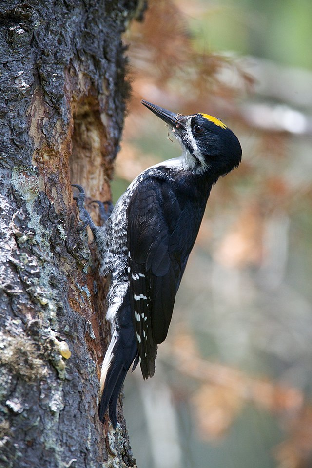

```{r setup, include=FALSE}
knitr::opts_chunk$set(collapse = TRUE, comment = "##", dev="png")
library(knitr)
library(kableExtra)
```


## Introduction to R

* `R` is two things:
   1. A statistical programming language
   2. A software package implementing the R language (available at [https://cran.r-project.org/](https://cran.r-project.org/))
* `RStudio` is a comprehensive working environment for R ([https://rstudio.com/products/rstudio/](https://rstudio.com/products/rstudio/))
   - An editor, for writing R programs
   - Tools to help you write and analyse code
   - An R console and interpreter


## Setting up your workspace

### Step 1

[Download and install R](https://cran.r-project.org)

### Step 2

[Download and Install Rstudio](https://posit.co/download/rstudio-desktop/)


## Parts of Rstudio

After launching Rstudio, create a new R **script** using the button in the upper left

{width=35%}

**Script**: a text file where you will write an R-program. Commands in a script will be run in order, from the top to the bottom.

## Parts of Rstudio

* The **editor** pane is where you will write your scripts. 
* Commands here are not run automatically!
	- Run them by using the *run* command (control-return$^1$)

{width=55%}

$^1$Mac users: usually you can substitute the command (&#8984;) key for control, and option for alt

## Parts of Rstudio

* The **console** pane is where commands are executed. 
* Commands here can be sent from a script
* Or you can enter them directly
	- Commands entered directly in the console are run as soon as you press return!
* Note that your panes may be in a slightly different arrangement!

{width=55%}


## Helpful vocabulary

* **console**: A window where you can type commands and view (text) results and output
* **interpreter**: Software that translates R commands into instructions for your computer in real time
* **script**: a text file containing a program, or series of commands
   - can be run **interactively** (sending commands one at a time to the console)
   - or in **batch mode** (all commands run, one after the other)
* **working directory**: location on your computer where R will search for files, data, etc.


## Recommendations
* Create an RStudio project to organize your work (File => New Project).
	- Everyone do this now for this course!
* Store all files in the project folder (your project will be **self-contained**).
* Save related commands together in a script.
* Annotate your code with comments. Write more comments than you need.
   - In R, anything after the `#` character is a comment and will be ignored by the interpreter.


## Variables

<div class="left lt">
* A **variable** is a name that points to some data. 
  - Variable names can contain lower- or upper-case letters, numbers, and the `_` symbol.
  - Names must start with letters and (when possible) should be descriptive
* Variables are given values by **assignment** using either the `=` or `<-` symbol

### Recommendations
* Use descriptive variable names instead of comments.
* Avoid 1- and 2- letter names.
* Separate words with underscores.
* Use a consistent assignment operator (`=` or `<-`, not both)
</div>

<div class="right rt">

```{r error=TRUE}
# Comments in R start with the # symbol
# anything after # will not be executed
# Comments are a useful way to annotate your code so you know what is 
# happening

# Legal variable names
x = 1
y0 = 5
time_of_day = "20:15"
dayOfWeek <- "Monday"

# bad!
# d is the diversity in our site, in species
d = 8

# better!
site_diversity = 8


# error
0y = 5
todays date = "February 21"
```

</div>


## Data types

* `numeric`: integers and floating-point (decimal) numbers
* `logical`: yes/no, true/false data; in R represented by the special values `TRUE` and `FALSE`
	- `T` and `F` (no quotes) can be used as shortcuts for `TRUE`/`FALSE`, but you should avoid this!
* `character`: strings, text
* `factor`: special variable type for categorical (nominal & ordinal) data


## Numeric operators

<div class="left lt">

* We use **operators** to perform computations on variables and constants
* The **assignment operators** give a value to a variable
	- `=`, `<-`
	- Both work mostly the same, use alt dash (-) for `<-`
* **Mathematical operators** allow us to do arithmetic
	- `+`, `-`, `*`, `/`, `^`
</div>

<div class="right rt">

```{r}
# assignment
x = 5
# equivalent
x <- 5

# class tells you the data type of a variable
class(x)

# math
x + 2
(3 + x) * 2
3^2

```

</div>


## Functions

<div class="left lt">
* **Functions** take **arguments** (which can be variables or constants).
* The function performs computations on the arguments.
* Functions can **return** a result, have **side-effects**, or both.

**Mathematical & functions**

* `sin()`, `cos()`
* `log()`, `exp()`, `sqrt()`

Get help on a function with `?` or `help()`, for example: `?log` or `help(log)`.
If you don´t know a function's name, you can search for a (likely/suspected) string in its name with `??`.


</div>

<div class="right rt">

```{r}
x = 5

# The print() function takes one or more arguments
#      in this case the variable x
# It returns no value, but has the side effect of printing the 
# value of x to the screen
print(x)

# compute the natural logarithm of x
# then store it in y, then print the result
y = log(x)
print(y)

# functions can take multiple arguments, and arguments can be named
# here we change the base of the logarithm
log(x, base = 10)
# equivalents, found in the help file with ?log
#     log(x, 10)
#     log10(x)
```

</div>


## Data structures: vectors

<div class="left lt">
* A **data structure** is a way of organizing multiple pieces of data into a single variable
* A `vector` holds one or more values of a single data type

</div>

<div class="right rt">
</div>


## Creating vectors

<div class="left lt">
* `c()` is a simple function that `c`oncatenates its arguments into a vector
* The `:` operator creates a sequence of integers, counting by ones
* More general sequences use the `seq` function
	- Third argument tells you what to count by
* Repeat values with `rep`
</div>

<div class="right rt">

```{r}
# The c() function stands for concatenate
# it groups items together into a vector
(five_numbers = c(3, 2, 8.6, 4, 9.75))

# Creating vectors
(one_to_ten = 1:10)
class(one_to_ten)
# integers are *also* numeric
is(one_to_ten, "numeric")

## sequences and repeats
seq(1, 5, 0.4)
rep(0, 3)


```
</div>


## Vectorized operations

<div class="left lt">
* Many of R's basic operators and functions are **vectorized**: they apply one-at-a-time to the whole vector.
* Vectors can be other data types, and can be converted between data types.
</div>

<div class="right rt">

```{r}

# math on vectors is performed on each element
five_numbers + 1
five_numbers^2

sin(five_numbers)

# vectors of other data types
class(five_numbers)
(five_letters = c("c", "b", "z", "q", "w"))
class(five_letters)
sort(five_letters)

as(five_numbers, "integer")

```

</div>


## Vectors: indexing

<div class="left lt">
* We can use **indexing** to get a part of a vector by its position
	- use the `[]` operator
	- an index can be multiple values!
	- any legal **expression** that returns integers can be used inside `[]`!
* In R, the first index is always 1
* Asking for an index outside the allowable range is an error

</div>

<div class="right rt">

```{r error = FALSE}
five_numbers
five_numbers[1]
five_numbers[3:5]
five_numbers[c(1,4)]

# get vector length
length(five_numbers)
five_numbers[10]

# can index with another variable
(i = length(five_numbers))
five_numbers[i]

# also an expression
five_numbers[i - 1]

```

</div>

## More basic functions

<div class="left lt">
* Basic statistical functions have mostly obvious names
* Mathematical functions will operate separately on each vector element
</div>

<div class="right rt">

```{r error = FALSE}
mean(five_numbers)
median(five_numbers)
sd(five_numbers)
var(five_numbers)
sum(five_numbers)

# mathematical functions
exp(five_numbers)
log(five_numbers)
```

</div>


## More programming: logic and comparison

<div class="left lt">
* The **logical** data type indicates yes/no, true/false data
* Represented by the special values `TRUE` and `FALSE` (no quotes)
* We can use **comparison operators** to compare values and produce **logical** results
	* `==`, `!=`, `<`, `>`, `<=`, `>=`
</div>

<div class="right rt">

```{r}
# less than, greater than, less/greater or equals
1 < 2
class(1 < 2)

2 <= 2
2 > 4
'q' >= 'm'

# equality testing
2 == 1 + 1
2 != 'q'

# be careful with decimals!
0.2 + 0.1 == 0.3
# preferred:
all.equal(0.1 + 0.2, 0.3)

```

</div>

## Logical operators

<div class="left lt">
* We can combine logical expressions with the **logical operators**
	* `&` (and), `|` (or; the vertical bar), `!` (not).

</div>

<div class="right rt">

```{r}
# and: both must be true
TRUE & TRUE
TRUE & FALSE
FALSE & FALSE

# or: only one needs to be true
TRUE | FALSE
FALSE | FALSE

# not: returns the opposite
!FALSE

# both statements are TRUE, so this is TRUE
1 + 1 == 2 & 2 < 4
```

</div>


## Reading in real data

Download the [Palmer penguins dataset](https://raw.githubusercontent.com/allisonhorst/palmerpenguins/main/inst/extdata/penguins.csv)

Save this in your project folder, inside another folder named `data`


```{r penguins, echo=FALSE, fig.align = "left", out.width="35%"}
knitr::include_graphics("img/lter_penguins.png")
```

<font size=4>Artwork by @allison_horst</font>

## Reading in real data

<div class="left lt">
* The `read.csv` function takes a file path or URL as the argument
* Returns a tabular data structure called a `data.frame`
* `"data/penguins.csv"` is a **relative path**. 
	- R will search inside the working directory for a folder named `"data"`.
* An **absolute path** gives the location on your computer, starting from the very top. Example:

`"/Users/ltalluto/Desktop/intro_r/data/penguins.csv"`

**Recommendation**: use relative paths!

*Hint: use `..` to refer to one directory above the current (working) directory*

</div>


<div class="right rt">

```{r}
penguins = read.csv("data/penguins.csv")
# read.csv also takes URLs!
# penguins = read.csv("https://raw.githubusercontent.com/allisonhorst/palmerpenguins/main/inst/extdata/penguins.csv")
class(penguins)
```


</div>


## Data prep recommendations
<div class="left lt">

* Prepare data in excel
* The first row is a header with column names
* Choose good column names (no spaces or special characters, include units)
* In a separate file, describe the dataset, how it was collected, and the meaning of each column
* Arrange your data so that each row is a single observation, each column is a variable ("tidy" data)

</div>

<div class="right rt">
```{r echo = FALSE, results = 'asis'}
kable_styling(kable(head(penguins)), font_size = 12)
```
</div>


## Working with data frames

<div class="left lt">
* A `data.frame` holds tabular data
   - Each `row` of a data frame is a single **case** (i.e., an observation)
   - Each `column` of a data frame is a single variable (i.e., a `vector`, all the same data type)
* `head` shows the first few rows of a data frame

</div>

<div class="right rt">
   
```{r, results = "hide"}
# Load a dataset named 'penguins' and convert it to a data frame
# this dataset comes from a package, "palmerpenguins"
data(penguins, package = "palmerpenguins")
penguins = as.data.frame(penguins)
head(penguins)
```

```{r echo = FALSE, results = 'asis'}
kable_styling(kable(head(penguins)), font_size = 12)
```


</div>


## Working with data frames

* `View` shows the data frame in a graphical window (Or double-click the dataset in the `Environment` tab)
* `str` gives you a summary of the **str**ucture of the data

```{r}
str(penguins)
```

* `nrow`, `ncol`, `dim` give you dimensions of the data frame

```{r}
# data frame dimensions
nrow(penguins)
ncol(penguins)
dim(penguins)
```


## Working with data frames

<div class="left lt">

* Variable names are not visible in the global environment!
* You must access them using `$` or `[]`, lets you 'peek' inside the data.frame and access variables there.

</div>

<div class="right rt">

```{r, error = TRUE}

# Error: there is no variable with that name!
bill_length_mm
```

```{r, results = "hide"}

# accessing a variable by name
penguins$bill_length_mm
penguins[, 'bill_length_mm']
```

```{r}
# equivalent: accessing a variable by position
penguins[,3] # get every row in the third column
```

</div>


## Working with data frames

<div class="left lt">

* Variable names are not visible in the global environment!
* You must access them using `$` or `[]`, lets you 'peek' inside the data.frame and access variables there.

</div>

<div class="right rt">


```{r}
# accessing a variable by name, and subsetting rows
penguins[1:10,"bill_length_mm"]
```
</div>


## Subsetting data frames

<div class="left lt">
* More complex indexing is available with `[]`
</div>

<div class="right rt">
```{r}
# Get the first value in the third column
penguins[1,3]

# Get the whole third column, then use head to print the first six values
head(penguins[,3])

# First five values of columns 3 and 4
penguins[1:5, c(3,4)]

# Can also index by name
penguins[1:5, c("bill_length_mm", "bill_depth_mm")]

# Remove the first 300 rows
penguins[-(1:300),]
```
</div>


## Logical subsets

* We can take a part of a `data.frame` or `vector` based on some condition
* Easy to use, easy to read: Use the `subset` function

```{r subset}
# Return a data frame with only one species
penguins_adelie = subset(penguins, species == "Adelie")
head(penguins_adelie)

```


## Logical subsets

* We can take a part of a `data.frame` or `vector` based on some condition
* Easy to use, easy to read: Use the `subset` function
* Select from multiple categories with the `%in%` operator

```{r subset_2, eval = FALSE}
# Try these, what do they do?
subset(penguins, species == "Adelie" & sex == "Male" & year != 2007)

subset(penguins, species %in% c("Chinstrap", "Gentoo"))

```


## Logical subsets

* We can take a part of a `data.frame` or `vector` based on some condition
* Easy to use, easy to read: Use the `subset` function
* Select from multiple categories with the `%in%` operator
* Hard, but more flexible: use logical indices in `[]`

```{r subset_3}
# get the body mass of all female penguins with a larger-than-average bill length
penguins[penguins$sex == "female" & penguins$bill_length_mm > mean(penguins$bill_length_mm, na.rm = TRUE), "body_mass_g"]
```


## Practise with data frames

Read in the penguin data using `read.csv`. Store it in a variable named `penguins`. Then try to do the following.

1. How many rows and columns are in the dataset? Use `dim`, `nrow`, and `ncol`.
2. What is the output of `mean(penguins$bill_depth_mm)`? Why? What if you try `mean(penguins$bill_depth_mm, na.rm = TRUE)`? Check the help file by typing `?mean`. Does the same logic work for `sd`?
3. How many penguins were captured in each year? Try the `table` function.
4. You can use table with multiple columns of data. Try to find out how many of each species were captured in each year.
	 - Hint: use `c()` inside `[]` to get multiple columns. See the previous slide.
5. Add a new column called `body_mass_kg`, and compute the body mass, in kg instead of g.
	- Hint: you can use `$` to create a new column by name
6. Use `subset` to compute the mean bill length and bill depth for Gentoo penguins

## Practise with data frames

```{r ex1}
## 1.
# dim gives rows and columns, in that order
nrow(penguins)
ncol(penguins)
dim(penguins)

## 2.
# there are missing values, so this doesn't work
mean(penguins$bill_depth_mm)
# adding na.rm = TRUE gives us what we expect
mean(penguins$bill_depth_mm, na.rm = TRUE)
sd(penguins$bill_depth_mm, na.rm = TRUE)

## 3.
table(penguins$year)

## 4. 
table(penguins[, c('species', 'year')])

## 5.
# nothing is printed! but the new column is created with the data already stored
# can confirm by looking at the data frame with head
penguins$body_mass_kg = penguins$body_mass_g / 1000
head(penguins)


## 6.
penguins_gentoo = subset(penguins, species == "Gentoo")
mean(penguins_gentoo$bill_length_mm, na.rm = TRUE)
mean(penguins_gentoo$bill_depth_mm, na.rm = TRUE)

```


## Cleaning up the penguin data

<div class="left lt">
Our data frame has some missing data. Let's remove the incomplete cases using the `complete.cases` function.
</div>

<div class="right rt">

```{r eval = FALSE}
# Try this: what is the output?
complete.cases(penguins)
```

```{r}
# what is this doing? why does this work?
sum(! complete.cases(penguins))
```

```{r}
# Again, break this down one piece at a time
# start inside the brackets and work out
penguins = penguins[complete.cases(penguins), ]
```
</div>


## Getting summary statistics

<div class="left lt">
* We have learned some basic functions for summary statistics
	- `mean`, `sd`, `var`
	- `quantile`, `range`, `sum`
	- `complete.cases`
* But our data has multiple partitions! 
	- `species`, `sex`, `year`, `island`
	- What if we want to summarise across these partitions?

</div>

<div class="right rt">
```{r echo = FALSE}
library(ggplot2)
p2 = reshape2::melt(within(penguins, rm("body_mass_kg")), id.vars = c('species', 'island', 'sex', 'year'))
peng_box = ggplot(p2) + geom_boxplot(aes(x = species, fill = sex, y = value)) + 
	facet_wrap(~variable, scales = "free_y", strip.position = "left",
			   labeller = as_labeller(c(bill_length_mm = "Bill length (mm)", bill_depth_mm = "Bill depth (mm)",
			   						 flipper_length_mm = "Flipper length (mm)", body_mass_g = "Body mass (g)"))) +
	scale_fill_manual(values = c("pink","royalblue")) + theme_minimal() + 
	theme(strip.placement = "outside", axis.title.y=element_blank(), strip.text = element_text(size = 12),
		  axis.text.y = element_text(size = 11), axis.text.x = element_text(size = 11))
peng_box
```
</div>
	

## Getting summary statistics

<div class="left lt">
* `table` allows us to count cases across partitions
* `tapply` (apply a function in a table) is a generalisation of `table`, allows us to compute any statistic across partitions
	- syntax: first the variable, then the partition, then the statistical function, then additional arguments

```{r}
# one variable, one partition
tapply(penguins$bill_length_mm, penguins$species, mean, na.rm = TRUE)

# one variable, two partitions
tapply(penguins$bill_length_mm, penguins[, c('species', 'sex')], 
	   mean, na.rm = TRUE)
```
</div>

<div class="right rt">
```{r echo = FALSE}
peng_box
```
</div>
	

## Getting summary statistics

<div class="left lt">
* `table` allows us to count cases across partitions
* `tapply` (apply a function in a table) is a generalisation of `table`, allows us to compute any statistic across partitions
	- syntax: first the variable, then the partition, then the statistical function, then additional arguments
* `sapply` (simple apply) applies a function to multiple *variables* but with no partitions
	- first the variables, then the function

```{r}
# compute the sd of every variable
pvars = penguins[, c('bill_length_mm', 'bill_depth_mm', 
					 'flipper_length_mm', 'body_mass_g')]
sapply(pvars, sd)
```
</div>

<div class="right rt">
```{r echo = FALSE}
peng_box
```
</div>

## Summary statistics: practise

* Subset the data to look only at Adelie penguins.
* Does the distribution of flipper length of Adelie penguins vary among the different islands? Make sure you account for sex. Check the mean, sd, median, min, and max.
* Try making a box and whisker plot using the `boxplot` function. Try the following syntax: `boxplot(y ~ group1 + group2, data = penguins)`. 
	- For `y`, substitute the name of the variable inside penguins that you want to plot (e.g., `flipper_length_mm`).
	- For `group1` and `group2`, substitite the names of any grouping variables you want to use, like `sex`.
* Customize your plot. Check the help file for boxplot and try changing some of the defaults to improve the appearance of your plot. Some example argu,ments you could change:
	- `xlab` and `ylab`, the axis titles
	- `border`, `col`, the colors of the box borders and the fill color
	- `notch`, `boxwex` (see if you can figure them out from the help file, or by experimenting)


## Summary statistics: practise
<div class="left lt">

```{r ex2_1}
# Subset the data to look only at Adelie penguins.
penguins_adelie = subset(penguins, species == "Adelie")

# Does the distribution of flipper length of Adelie penguins vary
# among the different islands?
# we can use tapply with the different functions

## mean
tapply(penguins_adelie$flipper_length_mm, 
	   penguins_adelie[, c('island', 'sex')], mean)

## sd
tapply(penguins_adelie$flipper_length_mm, 
	   penguins_adelie[, c('island', 'sex')], sd)

## median
tapply(penguins_adelie$flipper_length_mm, 
	   penguins_adelie[, c('island', 'sex')], median)

## min
tapply(penguins_adelie$flipper_length_mm, 
	   penguins_adelie[, c('island', 'sex')], min)

## max
tapply(penguins_adelie$flipper_length_mm, 
	   penguins_adelie[, c('island', 'sex')], max)

```
</div>

## Summary statistics: practise
<div class="left lt">

```{r ex2_2, eval = FALSE}
# a boxplot is a much nicer way to visualise this
boxplot(flipper_length_mm ~ island+sex, data = penguins_adelie)
```

</div>

<div class="right rt">
```{r ex2_plot1, echo = FALSE}
# a boxplot is a much nicer way to visualise this
boxplot(flipper_length_mm ~ island+sex, data = penguins_adelie)
```
</div>


## Summary statistics: practise
<div class="left lt">

```{r ex2_3, eval = FALSE}
# a boxplot is a much nicer way to visualise this
# the defaults are quite ugly, let's improve things
# I chose colours using colorbrewer
# https://colorbrewer2.org/#type=qualitative&scheme=Paired&n=7
# 3 colors, one for each island
cols = c("#a6cee3", "#fb9a99", "#fdbf6f")
boxplot(flipper_length_mm ~ island+sex, data = penguins_adelie, 
		at = c(1.6,2,2.4,    3.6,4,4.4), # at controls x-location, allows grouping by sex
		col = rep(cols, 2), # set the colours, repeated twice (female and male)
		names = c("", "Female", "", "", "Male", ""), # labels under the boxes
		xlab = "", ylab = "Flipper length (mm)", # set axis titles
		bty = 'n', #disable the box around the plot
		notch = TRUE,
		boxwex = 0.3 # thinner boxes
)
# add a legend to the plot
legend("topleft", legend = unique(penguins_adelie$island), 
	   title = "Island", fill = cols, bty = 'n')

```
</div>

<div class="right rt">
```{r ex2_plot2, echo = FALSE}
# a boxplot is a much nicer way to visualise this
# the defaults are quite ugly, let's improve things
# I chose colours using colorbrewer
# https://colorbrewer2.org/#type=qualitative&scheme=Paired&n=7
# 3 colors, one for each island
cols = c("#a6cee3", "#fb9a99", "#fdbf6f")
boxplot(flipper_length_mm ~ island+sex, data = penguins_adelie, 
		at = c(1.6,2,2.4,    3.6,4,4.4), # at controls x-location, allows grouping by sex
		col = rep(cols, 2), # set the colours, repeated twice (female and male)
		names = c("", "Female", "", "", "Male", ""), # labels under the boxes
		xlab = "", ylab = "Flipper length (mm)", # set axis titles
		bty = 'n', #disable the box around the plot
		notch = TRUE,
		boxwex = 0.3 # thinner boxes
)
# add a legend to the plot
legend("topleft", legend = unique(penguins_adelie$island), 
	   title = "Island", fill = cols, bty = 'n')

```
</div>


## Graphics in R

R currently has two dominant graphical engines

### Base graphics
* Built in to R.
* Simple to use
* Relatively easy syntax
* Plots usually need a lot of customization before they are finished

### ggplot2
* A package you must install.
* More complex syntax
* Produces publication-quality graphics with less customization needed.
* Plots can be saved in a variable, with customization added as needed.


## Histograms: show the distribution of a single variable

<div class="left lt">
```{r hist_base, fig.width=5, fig.height=5}
hist(penguins$bill_depth_mm)
```
</div>

<div class="right rt">
```{r hist_ggplot, fig.width=5, fig.height=5}
## do this once!
# install.packages("ggplot2")

## Once per session
library("ggplot2")

ggplot(penguins, aes(x = bill_depth_mm)) + geom_histogram()
```
</div>


## Histograms: show the distribution of a single variable

Defaults are not amazing, some improvements needed

<div class="left lt">

* `main = ""` disables the title
* `xlab` and `ylab` control axis labels
* `breaks` controls the number of bins in the histogram
* `col` sets the color of the bars
* `border` sets the color of the borders (`NA`: no border)

```{r hist_base2null, fig.width=5, fig.height=5, eval = FALSE}
hist(penguins$bill_depth_mm, main = "", xlab="Bill depth (mm)", 
	 ylab = "Frequency", breaks = 20, col="#999999", border=NA)
```
</div>

<div class="right rt">
```{r hist_base2, fig.width=5, fig.height=5, echo = FALSE}
hist(penguins$bill_depth_mm, main = "", xlab="Bill depth (mm)", 
	 ylab = "Frequency", breaks = 20, col="#999999", border=NA)
```
</div>


## Histograms: show the distribution of a single variable

<div class="left lt">

```{r hist_ggplot2null, fig.width=5, fig.height=5, eval = FALSE}
ggplot(penguins, aes(x = bill_depth_mm)) + 
	geom_histogram(bins = 20) + 
	theme_minimal() + xlab("Bill depth (mm)")
```
</div>

<div class="right rt">
```{r hist_ggplot2, fig.width=5, fig.height=5, echo = FALSE}
ggplot(penguins, aes(x = bill_depth_mm)) + 
	geom_histogram(bins = 20) + 
	theme_minimal() + xlab("Bill depth (mm)")
```
</div>

## Colours

<div class="left lt">
* R supports colours using the common HTML color coding: `#RRGGBB`
	- RR, GG, BB are the amounts of red, green, and blue
	- each ranges from `00` (none) to `FF` (most)
	- [Colour pickers](https://www.w3schools.com/colors/colors_picker.asp) online help you translate a color in real life to a coded color
* Best practise: choose colours using reputable packages based in colour theory
	- Continuous data: [scico](https://github.com/thomasp85/scico) and [viridis](https://github.com/sjmgarnier/viridis) are the best.
	- Categorical data: [rcolorbrewer](https://colorbrewer2.org/#type=sequential&scheme=BuGn&n=3) is simple, limited palettes, [iWantHue](https://medialab.github.io/iwanthue/) generates custom categorical palettes
* R also has 657 named colours: `col = 'rosybrown'`
* see the `colors()` function for the names
* You can use the `scales` package to generate custom palettes.

```{r}
head(colors())
```
</div>

<div class="right rt">

```{r echo = FALSE, fig.width=8, fig.height=4}
library(ggdark)
d = expand.grid(xl = 1:27, yb = 25:1)
d$colors = NA
d$colors[1:657] = colors()
d = d[complete.cases(d),]
par(mar = c(0,0,0,0))
plot(0,0, xlim = c(1,28), ylim = c(1,26), type = 'n', axes = FALSE, xlab = "", ylab = "")
with(d, rect(xl, yb, 1+xl, 1+yb, col = colors, border = NA))
with(d, text(xl, yb + 0.5, colors, col = invert_color(colors), cex = 0.3, adj = 0))
```

</div>


## Basic statistics: comparing means


* Hypothesis: in Gentoo penguins, males are heavier than females
* We can formally test this using `t.test`

```{r gentoo_mean}
penguins_gentoo = subset(penguins, species == "Gentoo")
tapply(penguins_gentoo$body_mass_g, penguins_gentoo$sex, mean)
```


## Comparing means: more than 2 groups

* We can use the function `aov` to do an analysis of variance when there are more than 2 groups or when there are more than two **factors**.
* Hypothesis 1: Average body mass varies by species
* Hypothesis 2: Average body mass varies by both species **and** sex


## Exercise: comparing means

### Hypothesis 1: in Gentoo penguins, males are heavier than females

1. Try to visualise the distribution of body masses in males and females using histograms. Does it look like there is a difference?
2. Use `t.test` to test the hypothesis. Check the help file to get started.


### Hypotheses 2 & 3

* Hypothesis 2: Average body mass varies by species
* Hypothesis 3: Average body mass varies by both species **and** sex

1. Create a boxplot (or try a violin plot using `geom_violin`) visualising the differences in body mass among these 2 different factor variables.
2. Use `aov` to perform an analysis of variance for each hypothesis. What do you conclude?

*Hints*

* With boxplot, we used the **formula** syntax `y ~ x` (y is modelled by x). This also works with `t.test`!
* Make sure you know which variety of test to do, and which hypothesis to test!
* `aov` doesn't produce very nice output by itself. Try saving the result of `aov` in a variable and using `summary` on that variable.


## Comparing 2 histograms

<div class="left lt">
**Base graphics**

Easiest just to do this in 2 panels. I set the axis limits so we have a fair comparison.


```{r gentoo_histnull, eval = FALSE}
# create a multipanel figure, organised by rows, with 1 row and 2 colums
par(mfrow = c(1,2))
hist(subset(penguins_gentoo, sex == "female")$body_mass_g, 
	 main = "Female Gentoo", col = 'pink', 
	 border = NA, xlab = "Body Mass (g)", xlim = c(3800, 6500))
hist(subset(penguins_gentoo, sex == "male")$body_mass_g, 
	 main = "Male Gentoo", col = 'lightblue', 
	 border = NA, xlab = "Body Mass (g)", xlim = c(3800, 6500))

```
</div>

<div class="right rt">
```{r gentoo_hist, echo = FALSE}
# create a multipanel figure, organised by rows, with 1 row and 2 colums
par(mfrow = c(1,2))
hist(subset(penguins_gentoo, sex == "female")$body_mass_g, 
	 main = "Female Gentoo", col = 'pink', 
	 border = NA, xlab = "Body Mass (g)", xlim = c(3800, 6500))
hist(subset(penguins_gentoo, sex == "male")$body_mass_g, 
	 main = "Male Gentoo", col = 'lightblue', 
	 border = NA, xlab = "Body Mass (g)", xlim = c(3800, 6500))

```

</div>

## Comparing 2 histograms
<div class="left lt">

**GGplot**

`ggplot` allows for fancier options

```{r gentoo_histggnull, eval = FALSE}
ggplot(penguins_gentoo, aes(x = body_mass_g, fill = sex)) + 
	geom_histogram(bins = 20, alpha = 0.8, position = "identity") + 
	theme_minimal() + xlab("Body Mass (g)") +
	scale_fill_manual("sex", values = c("pink", "lightblue"))
```
</div>

<div class="right rt">
```{r gentoo_histgg, echo = FALSE}
ggplot(penguins_gentoo, aes(x = body_mass_g, fill = sex)) + 
	geom_histogram(bins = 20, alpha = 0.8, position = "identity") + 
	theme_minimal() + xlab("Body Mass (g)") +
	scale_fill_manual("sex", values = c("pink", "lightblue"))
```
</div>

## Running a t.test
<div class="left lt">

* Hypothesis: in Gentoo penguins, males are heavier than females
	* Why `alternative = "less"`?
* Conclusion?

```{r gentoo_ttnu, eval = FALSE}
t.test(body_mass_g ~ sex, data = penguins_gentoo, alternative = "less")
```
</div>

<div class="right rt">
```{r gentoo_tt, echo = FALSE}
t.test(body_mass_g ~ sex, data = penguins_gentoo, alternative = "less")
```
</div>


## Boxplot: distribution of a y-variable across categorical x-variables

<div class="left lt">

```{r boxplot_cols}
library(RColorBrewer)
(cols = brewer.pal(3, "Paired"))#[c(1, 5, 7)])
```

```{r boxplot, eval=FALSE}

boxplot(body_mass_g ~ species+sex, data = penguins, 
		# at controls x-location, allows grouping by sex
		at = c(1.6,2,2.4,    3.6,4,4.4), 
		# set the colours, repeated twice (female and male)
		col = rep(cols, 2), 
		# axis label text size
		cex.axis = 0.8,
		# labels under the boxes
		names = c("", "Female", "", "", "Male", ""), 
		# set axis titles
		xlab = "", ylab = "Body mass (g)", 
		# disable the box around the plot
		bty = 'n', 
		notch = TRUE,
		# thinner boxes
		boxwex = 0.3 
)
# add a legend to the plot
legend("topleft", legend = unique(penguins$species), 
	   title = "Species", fill = cols, bty = 'n')

```
</div>

<div class="right rt">
```{r boxplot_base, echo = FALSE, fig.width=5, fig.height=5}
boxplot(body_mass_g ~ species+sex, data = penguins, 
		# at controls x-location, allows grouping by sex
		at = c(1.6,2,2.4,    3.6,4,4.4), 
		# set the colours, repeated twice (female and male)
		col = rep(cols, 2), 
		# axis label text size
		cex.axis = 0.8,
		# labels under the boxes
		names = c("", "Female", "", "", "Male", ""), 
		# set axis titles
		xlab = "", ylab = "Body mass (g)", 
		# disable the box around the plot
		bty = 'n', 
		notch = TRUE,
		# thinner boxes
		boxwex = 0.3 
)
# add a legend to the plot
legend("topleft", legend = unique(penguins$species), 
	   title = "Species", fill = cols, bty = 'n')
```
</div>


## Boxplots: useful for comparisons among multiple groups

<div class="left lt">

```{r boxplot2, eval = FALSE, fig.width=5, fig.height=5}
ggplot(penguins, aes(y = body_mass_g, x = sex, 
							fill = species)) + 
	geom_boxplot(notch = TRUE) + 
	theme_minimal() + ylab("Body Mass (g)") + xlab("") +
	scale_fill_brewer(palette = "Paired") 
```

</div>

<div class="right rt">

```{r boxplot_ggplot, echo = FALSE, fig.width=5, fig.height=5}
ggplot(penguins, aes(y = body_mass_g, x = sex, 
							fill = species)) + 
	geom_boxplot(notch = TRUE) + 
	theme_minimal() + ylab("Body Mass (g)") + xlab("") +
	scale_fill_brewer(palette = "Paired") 
```

</div>


## Violin plot: boxplot alternative that shows more information

<div class="left lt">

```{r violin_plotnull, eval = FALSE, fig.width=5, fig.height=5}
# another option!
ggplot(penguins, aes(y = body_mass_g, x = sex, 
							fill = species)) + 
	geom_violin() + 
	theme_minimal() + ylab("Body Mass (g)") + xlab("") +
	scale_fill_brewer(palette = "Paired") 
```
</div>

<div class="right rt">

```{r violin_plot, echo = FALSE, fig.width=5, fig.height=5}
# another option!
ggplot(penguins, aes(y = body_mass_g, x = sex, 
							fill = species)) + 
	geom_violin() + 
	theme_minimal() + ylab("Body Mass (g)") + xlab("") +
	scale_fill_brewer(palette = "Paired") 
```
</div>


## Correlation

<div class="left lt">
* We can use the `cor` function to compute correlations among 2 or more variables
* Compute a **correlation matrix** with the `cor` function using all 4 numeric variables.
* Choose 2 variables to test for a significant correlation using `cor.test`
* Use `plot` to produce a scatterplot of the 2 variables. Customize the plot to make it look a bit better
</div>

<div class="right rt">
```{r}
# If you use plot on a data frame, you can view multiple relationships at once
plot(penguins[, 3:6])
```
</div>

## Correlation

<div class="left lt">
* We can use the `cor` function to compute correlations among 2 or more variables
* Compute a **correlation matrix** with the `cor` function using all 4 numeric variables.

```{r}
# I use round to make the printing nicer
round(cor(penguins[, 3:6]), digits = 3)
```
</div>

<div class="right rt">
```{r}
# If you use plot on a data frame, you can view multiple relationships at once
plot(penguins[, 3:6])
```
</div>

## Correlation

<div class="left lt">
* We can use the `cor` function to compute correlations among 2 or more variables
* Compute a **correlation matrix** with the `cor` function using all 4 numeric variables.
* Choose 2 variables to test for a significant correlation using `cor.test`

```{r}
# I chose the weakest correlation
cor(penguins$bill_depth_mm, penguins$bill_length_mm)
cor.test(penguins$bill_depth_mm, penguins$bill_length_mm )
```
</div>

<div class="right rt">
```{r}
# magic spell to give each species a different color
cols = factor(penguins$species) 
plot(penguins$bill_depth_mm, penguins$bill_length_mm,
	 pch = 16, #dots instead of circles
	 col = cols, xlab = "Bill depth (mm)", 
	 ylab = "Bill length(mm)", bty = 'n'
)
legend("topleft", legend = levels(cols), fill = 1:3, bty = "n")
```
</div>


## Linear models

<div class="left lt">
* We found a significant **negative** correlation between bill length and depth.
	- Does this make sense?
	- Our visualisation suggests something more is going on
</div>

<div class="right rt">
```{r echo = FALSE}
cols = factor(penguins$species) # magic spell to give each species a different color
plot(penguins$bill_depth_mm, penguins$bill_length_mm,
	 pch = 16, #dots instead of circles
	 col = cols, xlab = "Bill depth (mm)", 
	 ylab = "Bill length(mm)", bty = 'n'
)
legend("topleft", legend = levels(cols), fill = 1:3, bty = "n")
```
</div>

## Linear models
<div class="left lt">
* We found a significant **negative** correlation between bill length and depth.
	- Does this make sense?
	- Our visualisation suggests something more is going on
* We can do regression and other kinds of **linear models** using the `lm` function
	- Like `aov`, use the `summary` function to get a better look at the results
	- the `anova` function can also be useful for models with categorical predictors
* Try building a model that looks for the bill depth and bill length relationship, partitioned by species and sex
</div>

<div class="right rt">
```{r echo = FALSE,  warning=FALSE, message=FALSE}
pl = ggplot(penguins, aes(x = bill_length_mm, y = bill_depth_mm, col = species, shape = sex)) + 
	geom_point() + 
	geom_smooth(method = "lm", se = FALSE) + 
	xlab("Bill length (mm)") + ylab("Bill depth (mm)") +
	theme_minimal()
pl
```
</div>


## Linear models
<div class="left lt">
* Try building a model that looks for the bill depth and bill length relationship, partitioned by species and sex
```{r}
mod_billdepth = lm(bill_depth_mm ~ bill_length_mm * species + bill_length_mm * sex, data = penguins)
summary(mod_billdepth)
anova(mod_billdepth)
```
</div>

<div class="right rt">
```{r echo = FALSE,  warning=FALSE, message=FALSE}
pl
```
</div>


## Comparing proportions

<div class="left lt">
* Is the sex ratio for Gentoo penguins significantly different from 0.5?
* Use the `table` function to view the counts
* Try `barplot` for visualising
* Use `prop.test` for the significance test

</div>


## Comparing proportions

<div class="left lt">
* Is the sex ratio for Gentoo penguins significantly different from 0.5?
* Use the `table` function to view the counts
* Try `barplot` for visualising
* Use `prop.test` for the significance test

```{r}
# save it in a variable so we can use the counts later
tab = table(penguins_gentoo$sex)
tab
prop.test(tab)
```
</div>

<div class="right rt">
```{r echo = FALSE}
barplot(tab, col = c("pink", "lightblue"))

```

</div>


## Tests of association: n × n Tables

<div class="left lt">

### Nesting holes of black-backed woodpeckers.

```{r}
woodpecker = read.csv("https://raw.githubusercontent.com/flee-group/vu_datenanalyse/main/datasets/woodpecker.csv")
head(woodpecker)

table(woodpecker)
```

We want to test for an *association* between the two variables (forest type and nest tree)

</div>

<div class="right rt">

{width=200px}

$H_0$: Nesting tree is not associated with forest type

$H_A$: Nest tree is associated with forest type

* Try `chisq.test` on these data.
* Use `barplot` or `geom_bar` to visualise
</div>


## Visualisation: Categorical Data

<div class="left lt">

Barplots, or proportional bars for counts within categories

```{r, fig.show='hide'}
table(woodpecker)

woodp_plot = ggplot(woodpecker, aes(x = nest_tree,
				fill = forest_type))
woodp_plot = woodp_plot + geom_bar(width = 0.5, 
					position=position_dodge())
woodp_plot = woodp_plot + xlab("Nest Tree Type") +
	theme_minimal() + labs(fill = "Forest Type")
woodp_plot
```

Side-by-side bars allow us to compare all categories on equal footing. 

</div>

<div class="right rt">
```{r, echo = FALSE}
woodp_plot
```
</div>


