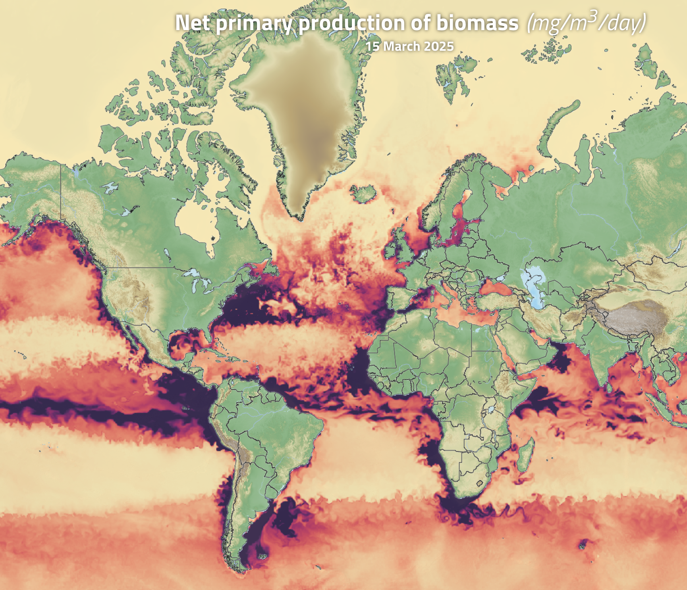
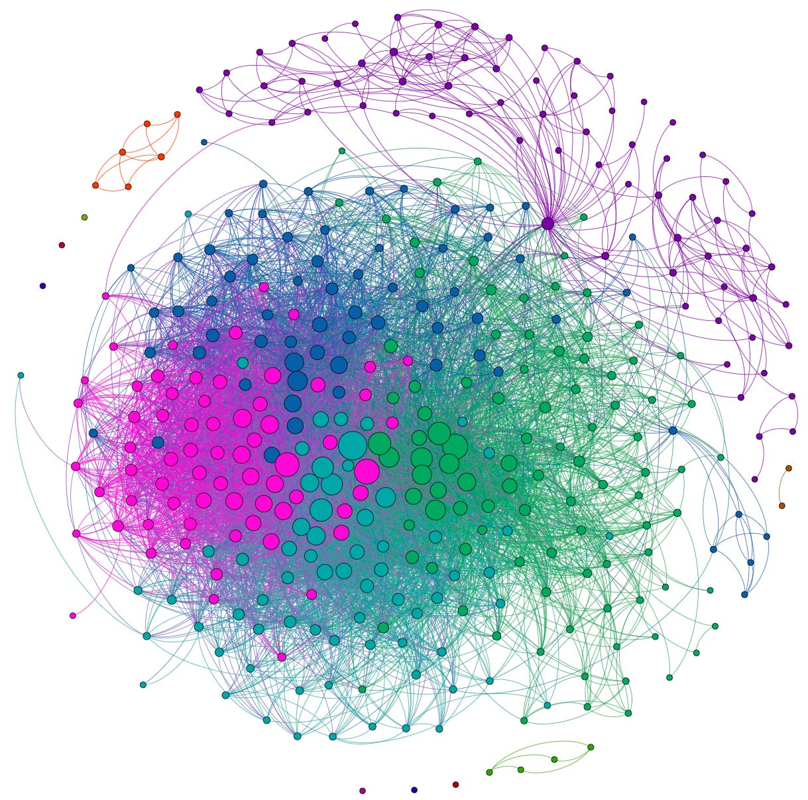
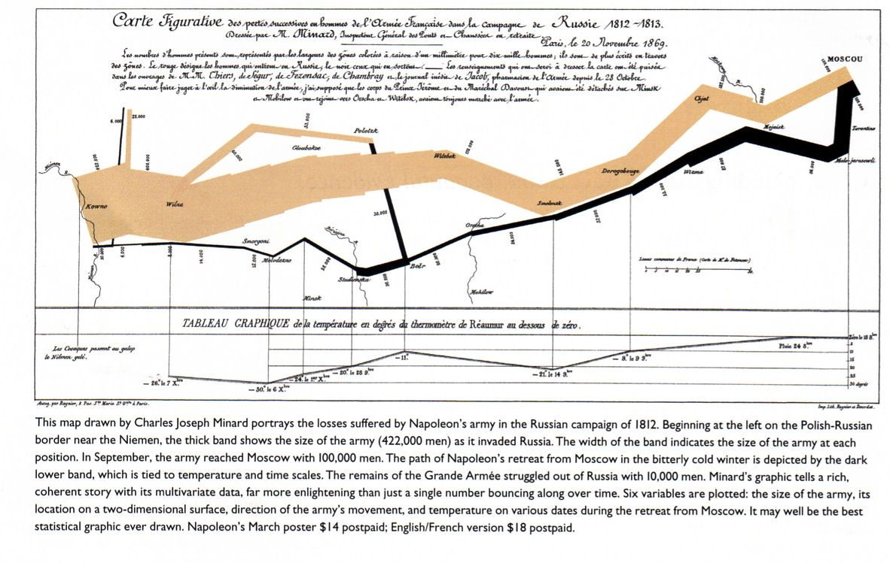
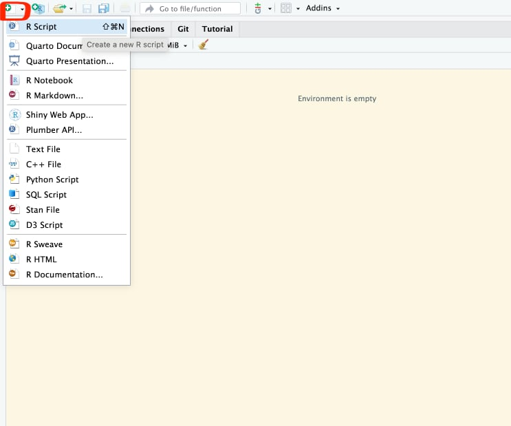
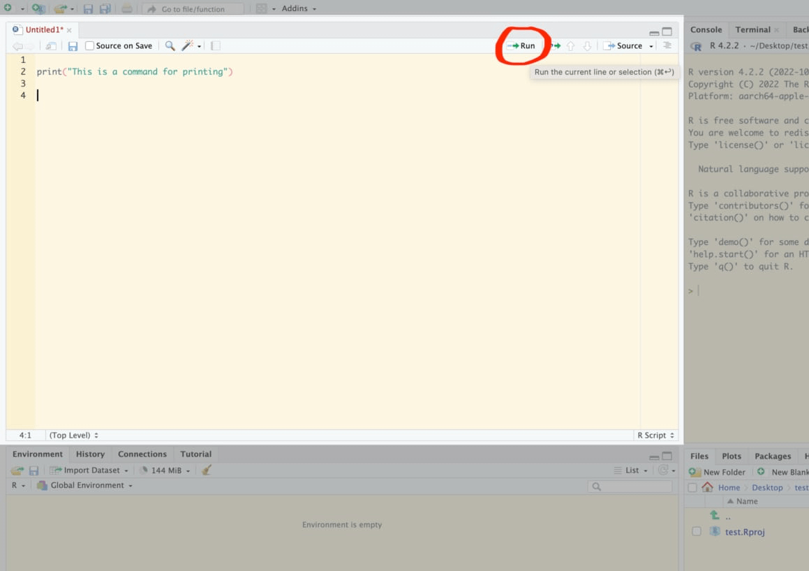
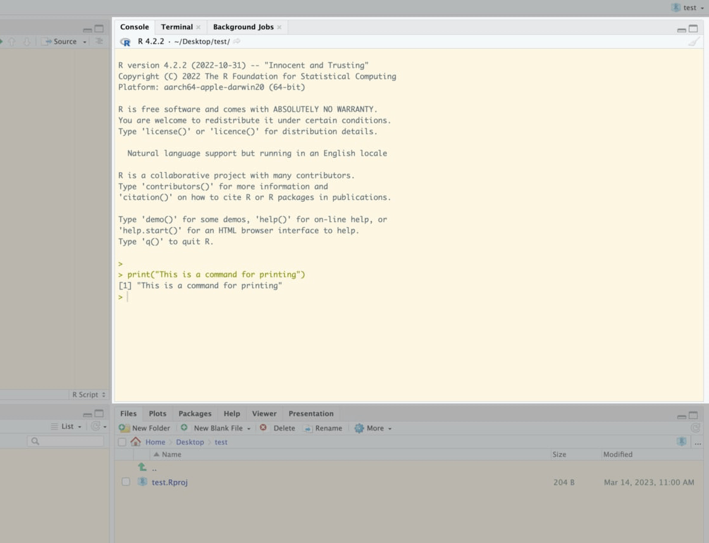
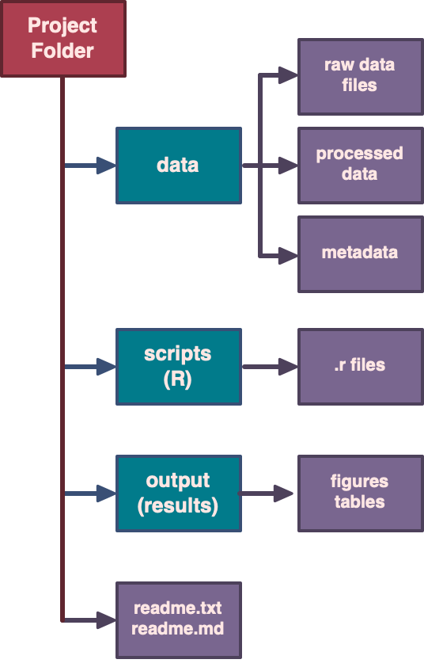
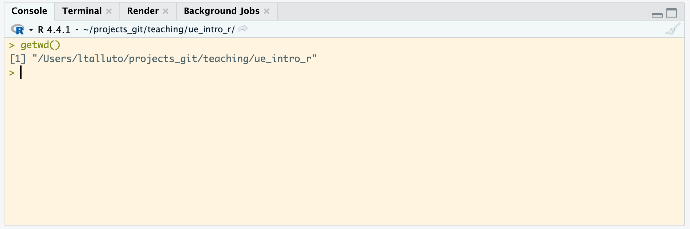
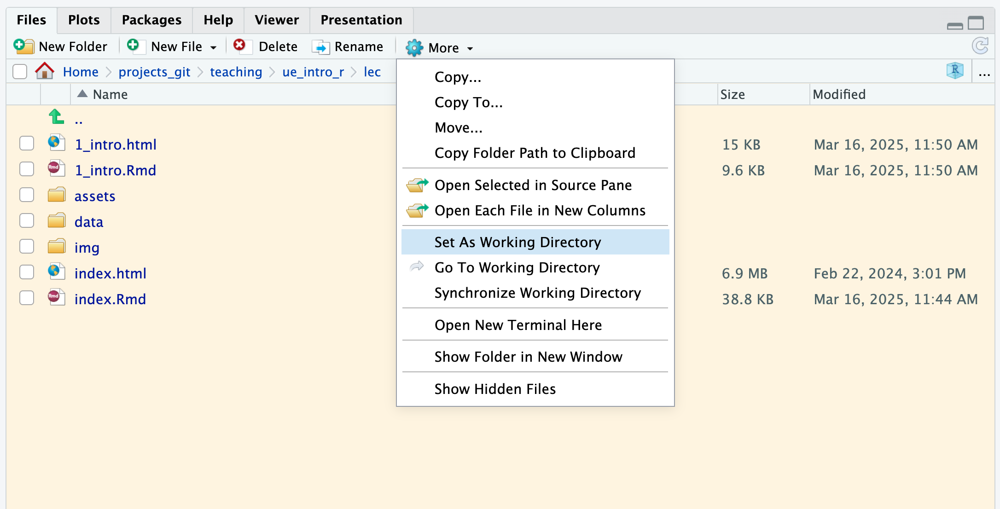

class: title-slide, middle

<style type="text/css">
  .title-slide {
    background-image: url('img/bg.jpg');
    background-color: #23373B;
    background-size: contain;
    border: 0px;
    background-position: 600px 0;
    line-height: 1;
  }
</style>

```{r setup, include=FALSE}
knitr::opts_chunk$set(collapse = TRUE, comment = "##", dev="png", error = TRUE)
library(knitr)
library(kableExtra)
```

# Lecture 1

<hr width="65%" align="left" size="0.3" color="orange"></hr>

## Introduction to scientific computing

<hr width="65%" align="left" size="0.3" color="orange" style="margin-bottom:40px;"></hr>

.instructors[
  **Introduction to R for Biologists** - Lauren Talluto
]


---
layout: true
# Why scientific computing?

---

- Growth in big data applications, remote sensing, monitoring, sequencing

.image60[]

.font50[copernicus.eu]

---

- Computation enables analyses that were previously impossible (permutation tests, Bayesian statistics, next-gen sequencing)

.image50[]

.font50[R package BNViewer]

---

- Enables the creation by non-artists of **highly effective visualisations**

.image70[]

.font50[Edward R Tufte. *The Visual Display of Quantitative Information*]


---
layout: true

# Why/what is R?

.rt30[
.rt[
[](https://cran.r-project.org)
]]

---
class: .lt70

- Open-source **domain-specific** language
--

- Scientific computing is built-in
--

- Large number of packages specifically oriented around statistics, data science, visualisation
--

- Standard language for statistics, and (to a lesser extent) bioinformatics
--

- Excellent tools for scientific communication
	- *Rmarkdown* for websites, reports, presentations
	- *Shiny* for webapps

---
layout: false

# Course objectives

- Learn fundamental concepts of R programming 
--

	* RStudio IDE
--

	* Key programming concepts
--

	* Planning, structuring, debugging
--

	* Good scientific computiung practises
--

- Data visualisation
--

- Basic data science

---

This course is for beginners! No programming experience is needed
--


We will *not* cover statistical theory or advanced concepts in computer science


---
# Course Format

- Brief lectures to introduce general concepts (< 1 hour per session)
- Structured exercises to get you coding in R

--

### Grading

- Participation in class, working on exercises (40%)
- Submission of a (group) report on the exercises (60%)
	
---

# Resources & Materials
- [Course web page](https://ltalluto.github.io/ue_intro_r)
- Getting help: [stackoverflow.com](stackoverflow.com), R help files, **avoid chatGPT**.

### You will need

- (recommended): your own laptop (you can also use university computers)
- Extra time outside class to finish exercises (if needed)

---

# Introduction to programming in R

---

# The R environment

* `R` is two things:
   1. A statistical programming language
   2. A software package implementing the R language (available at [https://cran.r-project.org/](https://cran.r-project.org/))
* `RStudio` is a comprehensive working environment for R ([https://rstudio.com/products/rstudio/](https://rstudio.com/products/rstudio/))
   - An editor, for writing R programs
   - Tools to help you write and analyse code
   - An R console and interpreter
   
---
layout: true
# Parts of RStudio

---

After launching Rstudio, create a new R **script** using the button in the upper left

.image50[]

**Script**: a text file where you will write an R-program. Commands in a script will be run in order, from the top to the bottom.

---

* The **editor** pane is where you will write your scripts. 
* Execute commands by using **run** (control-return $^1$)

.image60[]

$^1$Mac users: usually you can substitute the command (&#8984;) key for control, and option for alt

---

* The **console** pane is where commands are executed. 

.image60[

]
---
layout: false

# Helpful Vocabulary

* **console**: A window where you can type commands and view (text) results and output
* **interpreter**: Software that translates R commands into instructions for your computer in real time
* **script**: a text file containing a program, or series of commands
   - can be run **interactively** (sending commands one at a time to the console)
   - or in **batch mode** (all commands run, one after the other)
* **working directory**: location on your computer where R will search for files, data, etc.

---

# Organising scientific projects

* Create a project in RStudio to organise your work (File => New Project)
* Store all files in the project folder (your project will be **self-contained**).
* Filenames: ASCII letters (No accents), numbers, underscores (_) ONLY

---

# Project folder/file structure

.image40[]

---

# Preparing your data

* Prepare data in excel
* The first row is a header with column names
* Column names should be **legal variable names**
* In a separate file, describe the dataset, how it was collected, and the meaning of each column (including units!)
* Arrange your data so that each row is a single observation, each column is a variable ("tidy" data)

---
layout: true
# The working directory

Your **working directory** is the folder where R will look for files, folders, data.

---
* It is displayed at the top of the **Console** window. 
* You can also type `getwd()` in the console

.image80[]

---
* Usually set this to the **project root directory**
* It is set automatically for you if you open R by double-clicking the `project_name.Rproj` file

.image80[]

---

* Change it in the `Files` pane under `More`
* Or use `setwd("path/to/new/folder")` in the console.

.image80[]

---
layout: false
# Variables
* A **variable** is a name that points to some data. 
* Variable names can contain lower- or upper-case letters, numbers, and the `_` symbol.
* Names must start with letters and (when possible) should be descriptive
* Variables are given values by **assignment** using either the `=` or `<-` symbol
```{r varnames, error = TRUE}
# Comments in R start with the # symbol
# Legal variable names
x = 1
y0 = 5
time_of_day = "20:15"
dayOfWeek <- "Monday"
```
---

# Variables

### Recommendations
* Use descriptive variable names instead of comments.
* Avoid 1- and 2- letter names.
* Separate words with underscores.
* Use a consistent assignment operator (`=` or `<-`)

```{r variable_recs}
# bad!
# d is the diversity in our site, in species
d = 8

# better!
site_diversity = 8

```

---
layout: true
# Data types

`numeric` — `integer` — `logical` — `character` — `factor`

---

The **type** of a variable tells us what kind of information it contains.

* **numeric**: integers and floating-point (decimal) numbers
	* **integer**: a special case of numeric variable
* **logical**: yes/no, true/false data; in R represented by the special values `TRUE` and `FALSE`
* **character**: strings, text
* **factor**: special variable type for categorical (nominal & ordinal) data

---

Useful functions for querying a data type are `class()` and `mode()`.

```{r mode}
x = "a string"
mode(x)

y = 5.5
mode(y)
```

---

Convert between data types using `as`

```{r as}
y = 5.5
as(y, "integer")
```

---
layout: true

# Operators

**Operators** perform computations on variables and constants.

---
* The **assignment operators** give a value to a variable
	- `=`, `<-`
	- Both work mostly the same, use alt-dash (-) for `<-`

```{r assign_operator}
# assignment
x = 5

```

---
* **Mathematical operators** allow us to do arithmetic
	- `+`, `-`, `*`, `/`, `^`

```{r math_operator}
# math
x + 2
(3 + x) * 2
3^2
```

---
layout: true

# Functions

**Functions** allow for more complex operations on data

---
* Functions take **arguments** inside the brackets `()`
	* arguments can be variables or constants

```{r functions1}
x = 16
sqrt(x)
sqrt(25)
```

---
* Separate multiple arguments with a comma
* Clarify your code by **naming** the arguments
	- see the help files (here: `?log`) to learn argument names!

```{r functions2}
x = 100
log(x)
```

--

```{r functions3}
log(x, base = 10)
```

---
layout: true

# Vectors

Group multiple values of the same type together in a **vector**.

---

* create a vector with the concatenate function `c()`.

```{r concat}
five_numbers = c(3, 2, 8.6, 4, 9.75)
print(five_numbers)
```

---

* Create a sequence of integers with the `:` operator
```{r colon}
one_to_ten = 1:10
print(one_to_ten)
class(one_to_ten)
```

---

* Create arbitrary sequences using `seq()`
* Repeat a value using `rep()`

```{r repseq}
seq(1, 5, 0.5)
rep(0, 5)
```

---
layout: false

# Vectorized operations

* Many of R's basic operators and functions are **vectorized**: they apply one-at-a-time to the whole vector.

```{r}
five_numbers = c(3, 2, 8.6, 4, 9.75)
# math on vectors is performed on each element
five_numbers + 1
five_numbers^2
sin(five_numbers)
```

---
layout: true
# Indexing

We can use **indexing** with the `[]` operator to get a part of a vector by its position

---

```{r sq_brackets}
five_numbers = c(3, 7, 8.6, 4, 9.75)
five_numbers[3]

```

---

* The index itself can be a vector!

```{r sq_brackets_vec}
five_numbers = c(3, 7, 8.6, 4, 9.75)
five_numbers[2:3]
five_numbers[c(2,5)]
```

---

* Any legal **expression** that returns integers can be used inside `[]`!

```{r sq_brackets_expr}
i = 1
five_numbers = c(3, 7, 8.6, 4, 9.75)
five_numbers[i + 2]
```

---
layout: false


# Reading data

.lt70[
* Use `read.csv()` to read in a csv file, or `read.table()` for tab- or space-delimited files.
* Here I read in the [Palmer Penguins dataset](https://github.com/allisonhorst/palmerpenguins/)
]
.rt30[]


.lt100[
```{r read.csv}
# read.csv will also accept a url!
# url = "https://raw.githubusercontent.com/allisonhorst/
# palmerpenguins/main/inst/extdata/penguins.csv"
# penguins = read.csv(url)
penguins = read.csv("data/penguins.csv")
```
]
---
layout: true
# Data frames

A **data frame** is a data structure for tabular data

---

* `head()` shows the first few rows of a data frame
* `View()` will open the data frame in a spreadsheet-like viewer

```{r head}
head(penguins)
```

---

* Each row in a data frame is a single **case**
* Each column is a single variable, stored as a **vector**

```{r head2}
head(penguins)
```

---

* `str()` gives you a summary of the **str**ucture of the data

```{r str}
str(penguins)
```

---

* `nrow()`, `ncol()` and `dim()` give you data frame dimensions

```{r dim}
nrow(penguins)
ncol(penguins)
dim(penguins)
```

---

Data frame variables are normally **hidden**

```{r scope, error = TRUE}
str(penguins)

print(bill_length_mm[1:5])
```

---
layout: false

# Indexing with $

You can use the `$` operator to access a single variable *within* a data frame

```{r dollar, error = TRUE}
print(bill_length_mm[1:5])
print(penguins$bill_length_mm[1:5])

```
---

# The with function

The `with()` function is a special function that makes data frame variables visible insde the `{}` operator

```{r with}
with(penguins, {
	bill_length_mm[1:5] + bill_depth_mm[1:5]
})

```
---
layout: true

# Data frame subsets

* You can use the `subset` function to extract part of a data frame that meet certain **conditions**

---
* The `==` operator *tests* if two things are equal

```{r subset}

penguins_gentoo_only = subset(penguins, species == "Gentoo")
head(penguins_gentoo_only)
```

---
* The `>` and `<` operators test greater-than and less-than

```{r subset2}

penguins_big = subset(penguins, body_mass_g > 6000)
head(penguins_big)
```


