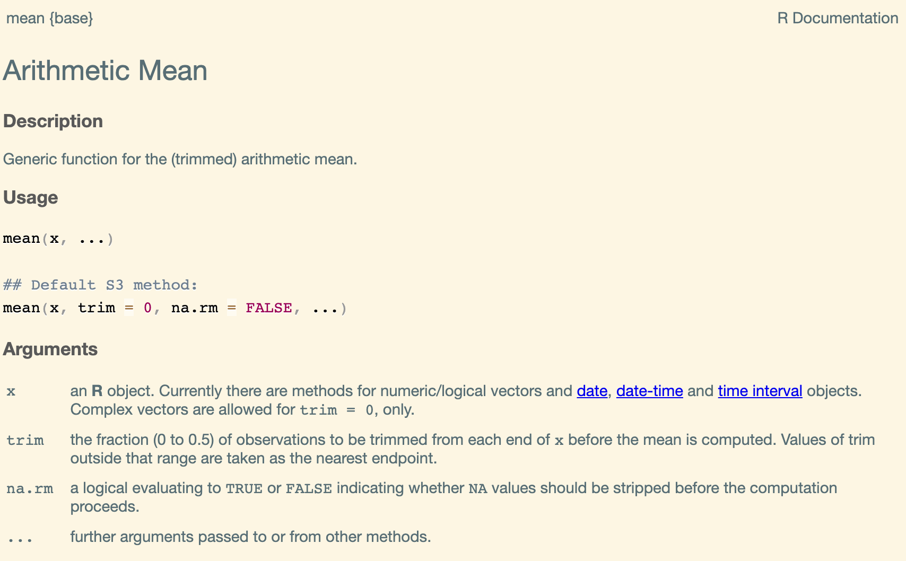

class: title-slide, middle

<style type="text/css">
  .title-slide {
    background-image: url('img/bg.jpg');
    background-color: #23373B;
    background-size: contain;
    border: 0px;
    background-position: 600px 0;
    line-height: 1;
  }
</style>

```{r setup, include=FALSE}
knitr::opts_chunk$set(collapse = TRUE, comment = "##", dev="svg", error = TRUE, fig.height=5.5, fig.width = 5.5)
library(knitr)
library(kableExtra)
```

# Lecture 2

<hr width="65%" align="left" size="0.3" color="orange"></hr>

## Summary Statistics & Base Graphics

<hr width="65%" align="left" size="0.3" color="orange" style="margin-bottom:40px;"></hr>

.instructors[
  **Introduction to R for Biologists** - Lauren Talluto
]

---

# Summary Statistics in R

### Helpful functions to try

```{r summary_stats, eval = FALSE}
penguins = read.csv("data/penguins.csv")
y = penguins$body_mass_g

summary(y)

# minimum, maximum
range(y)
min(y)
max(y)

# central tendency
mean(y)
median(y)

# variability
var(y)
sd(y)

```

---

# Dealing with missing values

The penguin dataset has some `NA` values. 

Check the help functions: `?mean`. Do you see any option for dealing with NAs?

.image80[]

---
layout:true
# Removing missing values

You can use `subset()` with `complete.cases()` to remove ALL rows that have at least one missing value.

---

```{r view_na}
penguins = read.csv("data/penguins.csv")
nrow(penguins)
head(penguins)
```

---

```{r drop_na}
penguins_no_na = subset(penguins, complete.cases(penguins))
nrow(penguins_no_na)
head(penguins_no_na)
```
---
layout:false
# Dealing with partitioned data

Our data have meaningful partitions, especially by `species` and `sex`!

Our summary statistics will make more sense if we compute them seperately by species/sex.

```{r plot_species, fig.width = 4.5, fig.height = 4.5}
with(penguins_no_na,
	plot(body_mass_g, bill_length_mm, col = factor(species), pch = 16)
)
```

---
# Computing by partition, the slow way

```{r partition}
mean(penguins_no_na$bill_length_mm[penguins_no_na$species == "Adelie"])
mean(penguins_no_na$bill_length_mm[penguins_no_na$species == "Chinstrap"])
mean(penguins_no_na$bill_length_mm[penguins_no_na$species == "Gentoo"])
```

---

# Computing by partition, the smarter way

```{r tapply}
tapply(penguins_no_na$bill_length_mm, # first the variable you want to summarise
	   penguins_no_na$species, # then the partitioning variable
	   mean) # then the function you want to use for summarising
```

---

# Multiple partitions

```{r tapply2}
tapply(penguins_no_na$bill_length_mm, 
	   penguins_no_na[, c('species', 'sex')], 
	   mean)
```

---

# R base graphics

A brief summary

---

# Histograms

A histogram shows the distribution of a single variable.

The default from `hist` is pretty ugly.

```{r default_hist}
hist(penguins_no_na$body_mass_g)
```

---

# Histograms

There are many options you can adjust.

```{r better_hist, fig.height = 4, fig.width = 4}
hist(penguins_no_na$body_mass_g,
	 main = "", # disables the title
	 xlab = "Penguin Body Mass (g)",
	 breaks = 15, # adjust the number of bins
	 col = 'skyblue', border = 'darkblue')
```


---

# Colours - named colours

* R has 657 named colours: `col = 'rosybrown'`
* see the `colors()` function for the names

```{r echo = FALSE, fig.width=8, fig.height=4}
library(ggdark)
d = expand.grid(xl = 1:27, yb = 25:1)
d$colors = NA
d$colors[1:657] = colors()
d = d[complete.cases(d),]
par(mar = c(0,0,0,0))
plot(0,0, xlim = c(1,28), ylim = c(1,26), type = 'n', axes = FALSE, xlab = "", ylab = "")
with(d, rect(xl, yb, 1+xl, 1+yb, col = colors, border = NA))
with(d, text(xl, yb + 0.5, colors, col = invert_color(colors), cex = 0.3, adj = 0))
```

---

# Colours - 24-bit colour

* R supports colours using the common HTML color coding: `#RRGGBB`
	- RR, GG, BB are the amounts of red, green, and blue
	- each ranges from `00` (none) to `FF` (most)
	- [Colour pickers](https://www.w3schools.com/colors/colors_picker.asp) online help you translate a color in real life to a coded color
	
```{r color_hist, fig.height = 4, fig.width = 4}
hist(penguins_no_na$body_mass_g, col = "#77aa11", border = "#005500")
```

---

# Colour advice

* Best practise: choose colours using reputable packages based in colour theory
	- [scico](https://github.com/thomasp85/scico) (continuous data)
	- [viridis](https://github.com/sjmgarnier/viridis) (continuous data)
	- [rcolorbrewer](https://colorbrewer2.org/#type=sequential&scheme=BuGn&n=3) (Categorical data)
	- [iWantHue](https://medialab.github.io/iwanthue/) (generates custom categorical palettes)


---

# Scatterplots

For comparing how two variables *covary*

```{r basic_scatter}
plot(penguins$body_mass_g, penguins$bill_length_mm, 
	 xlab = "Body Mass (g)", ylab = "Bill Length (mm)")
```

---

# Scatterplots

I can create a variable to store the colour I want to use for each point.

```{r basic_scatter_col, fig.height = 4.5, fig.width = 4.5}
penguins$color[penguins$species == "Adelie"] = "#ff561b"
penguins$color[penguins$species == "Chinstrap"] = "#b952c0"
penguins$color[penguins$species == "Gentoo"] = "#00676a"


plot(penguins$body_mass_g, penguins$bill_length_mm, 
	 xlab = "Body Mass (g)", ylab = "Bill Length (mm)",
	 col = penguins$color, pch = 16) # pch=16 uses a solid circle
```

---

# Scatterplots

I can do the same for sex. `ifelse()` works great if you have 2 categories!

```{r basic_scatter_col_pch, fig.height = 4.5, fig.width = 4.5}
penguins$symbol = ifelse(penguins$sex == "male", 15, 17)


plot(penguins$body_mass_g, penguins$bill_length_mm, 
	 xlab = "Body Mass (g)", ylab = "Bill Length (mm)",
	 col = penguins$color, pch = penguins$symbol) 
```

---

# Annotations

You may *annotate* plots by running commands after you use the `plot()` command. Things to try:

```{r annotate, eval = FALSE}
legend() # create a legend
abline() # create a line if you know intercept/slope
lines() # more general function for adding lines
points() # add x-y points
text() # Add text annotations
mtext() # Add text to plot margins

```

---

# Add a legend

```{r annotate_leg}
plot(penguins$body_mass_g, penguins$bill_length_mm, 
	 xlab = "Body Mass (g)", ylab = "Bill Length (mm)",
	 col = penguins$color, pch = penguins$symbol)

legend("bottomright", 
	   legend = c("Adelie", "Chinstrap", "Gentoo", "male", "female"),
	   col = c("#ff561b", "#b952c0", "#00676a", "black", "black"), 
	   pch = c(16, 16, 16, 15, 17))

```

---

# Boxplots: For summarizing across partitions


* **Boxplots** (sometimes **box-and-whisker** diagrams) summarize key statistics.
	- median
	- first and third quartiles (hinges)
	- approx. 95% confidence interval for median (notch)
	- min/max (or quartile + 1.5*IQR) (whiskers)
* They are very useful for comparing variables among groups.
* `y ~ group` is a special data type called a `formula`


---

# Boxplots: For summarizing across partitions

```{r, eval = FALSE}
boxplot(body_mass_g ~ species, data = penguins, boxwex=0.4, notch = TRUE)
```

```{r, echo = FALSE}
library(RColorBrewer)
cols = brewer.pal(8, "Set1")
boxplot(body_mass_g ~ species, data = penguins, boxwex=0.4, notch = TRUE)
rng = range(penguins$body_mass_g[penguins$species == "Adelie"])
lines(c(0.75, 0.75), rng, col=cols[1])
text(0.9, rng[2] + 100, "range", col=cols[1], pos=2)

iqr = quantile(penguins$body_mass_g[penguins$species == "Chinstrap"], c(0.25, 0.75))
lines(c(1.75, 1.75), iqr, col=cols[2])
text(1.75, iqr[2], "IQR", col=cols[2], pos=2)
med = median(penguins$body_mass_g[penguins$species == "Chinstrap"])
text(2.15, med, "median", col=cols[3], pos=4)

lines(c(2.75, 2.75), c(4950, 5150), col=cols[4])
text(2.75, 4950, "~95 % CI", col = cols[4], pos = 2)

text(1.7,5700, 
     "outliers\n x < quartile(x, 0.25) - 1.5*IQR(x)\n x > quartile(x, 0.75) + 1.5*IQR(x)", 
     pos=1, col=cols[5], cex=0.7)
lines(c(1.8, 2), c(5300, 4850), col = cols[5])
```

---
# Making a boxplot

```{r boxplot, eval = FALSE}
cols = c("#ff561b", "#b952c0", "#00676a")
boxplot(body_mass_g ~ species+sex, data = penguins, 
        # set the colours, repeated twice (female and male)
        col = rep(cols, 2), 
        # axis label text size
        cex.axis = 0.8,
        # labels under the boxes
        names = c("", "Female", "", "", "Male", ""), 
        # set axis titles
        xlab = "", ylab = "Body mass (g)", 
        # disable the box around the plot
        bty = 'n', 
        notch = TRUE
)
# add a legend to the plot
legend("topleft", legend = unique(penguins$species), 
       title = "Species", fill = cols, bty = 'n')
       
```

---

# Boxplots: For summarizing across partitions

```{r boxplot2, echo = FALSE}
cols = c("#ff561b", "#b952c0", "#00676a")
boxplot(body_mass_g ~ species+sex, data = penguins, 
        # set the colours, repeated twice (female and male)
        col = rep(cols, 2), 
        # axis label text size
        cex.axis = 0.8,
        # labels under the boxes
        names = c("", "Female", "", "", "Male", ""), 
        # set axis titles
        xlab = "", ylab = "Body mass (g)", 
        # disable the box around the plot
        bty = 'n', 
        notch = TRUE
)
# add a legend to the plot
legend("topleft", legend = unique(penguins$species), 
       title = "Species", fill = cols, bty = 'n')
       
```

---


# Boxplots: For summarizing across partitions

```{r boxplot3, echo = FALSE}
cols = c("#ff561b", "#b952c0", "#00676a")
boxplot(body_mass_g ~ species+sex, data = penguins, 
        # set the colours, repeated twice (female and male)
        col = rep(cols, 2), 
        # axis label text size
        cex.axis = 0.8,
        # labels under the boxes
        names = c("", "Female", "", "", "Male", ""), 
        # set axis titles
        xlab = "", ylab = "Body mass (g)", 
        # disable the box around the plot
        bty = 'n', 
        notch = TRUE
)
# add a legend to the plot
legend("topleft", legend = unique(penguins$species), 
       title = "Species", fill = cols, bty = 'n')
abline(v = 3.5, lty=2)   
```

Add a line with `abline()` to distinguish male vs female. 

Or experiment with the `at = ` argument.